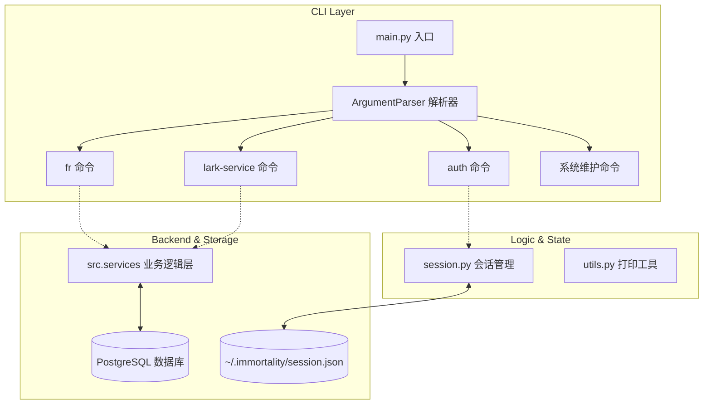
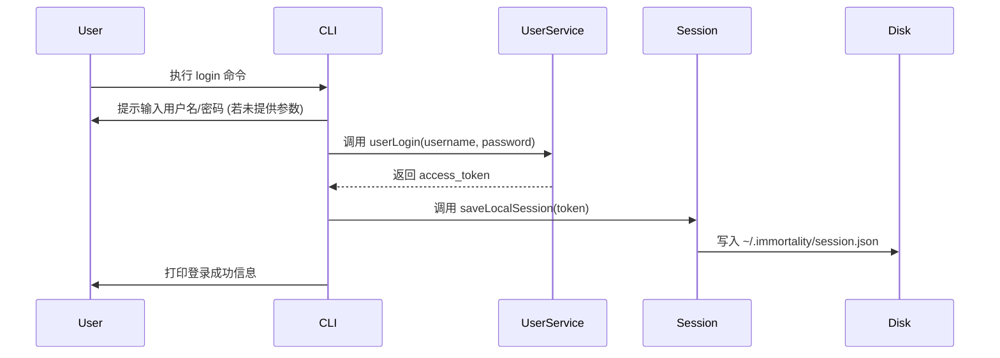
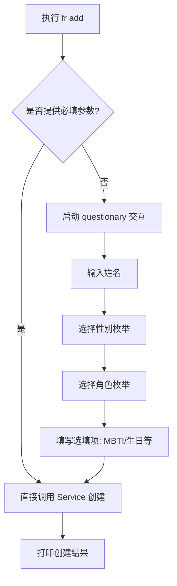
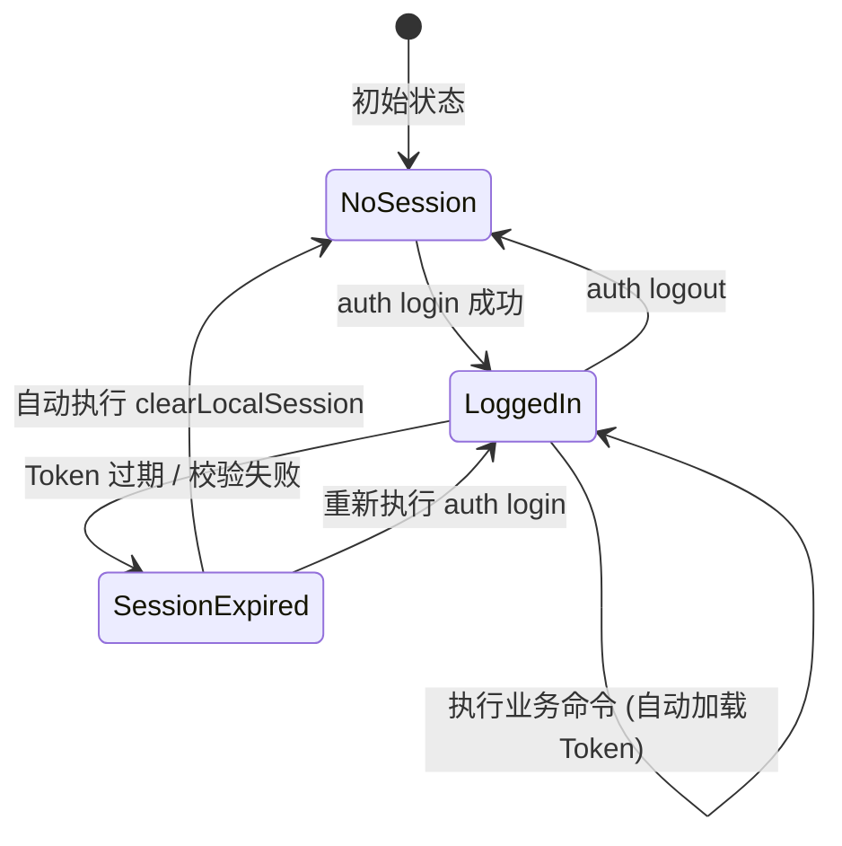

# CLI 工具参考

## 目录
1. [模块概览](#模块概览)
2. [工具定位](#工具定位)
3. [架构设计](#架构设计)
4. [核心组件](#核心组件)
5. [身份验证与 Token 管理 (auth)](#身份验证与-token-管理-auth)
6. [人格数据管理 (fr)](#人格数据管理-fr)
7. [飞书服务管理 (lark-service)](#飞书服务管理-lark-service)
8. [系统诊断与维护](#系统诊断与-维护)
9. [会话管理机制](#会话管理机制)
10. [错误处理与退出码](#错误处理与退出码)
11. [文件参考](#文件参考)

## 模块概览

`src/cli` 模块是 Immortality 项目的命令行工具集，为开发者和系统管理员提供了一站式的操作界面。该模块负责系统的初始化配置、运行环境检查、用户身份验证、人格数据维护以及服务的生命周期管理。

在文件规模上，该模块包含以下核心组成部分：
- **总文件数**：共 9 个 Python 核心文件。
- **子模块结构**：
    - `commands/`：包含所有具体的子命令实现，如 `auth.py`、`fr.py`、`lark_service.py` 和 `index.py`。
    - `assets/`：存放 CLI 运行所需的静态资源，包括 Docker 配置和环境变量模板。
    - **核心逻辑层**：由 `main.py`（入口）、`session.py`（会话管理）、`utils.py`（工具函数）和 `constants.py`（常量定义）组成。

本参考手册将深入剖析 CLI 的内部架构，并提供详尽的命令使用说明，确保用户能够高效、准确地使用该工具。

## 工具定位

Immortality CLI 工具被定位为系统的“控制中枢”。在复杂的分布式或微服务架构中，CLI 工具扮演着多重角色：

1.  **环境引导者 (Bootstrapper)**：通过 `setup` 命令，CLI 引导用户完成复杂的环境变量配置，并自动编排 Docker 容器（如 PostgreSQL），极大降低了系统的部署门槛。
2.  **系统诊断专家 (Diagnostics)**：`doctor` 命令提供了全面的系统健康检查，覆盖了从 Python 版本、依赖完整性到数据库连通性的各个维度，是排查运行故障的首选工具。
3.  **数据交互桥梁 (Data Interfacing)**：对于人格数据（FR）的导入、导出、同步和查询，CLI 提供了比 API 更直接的交互方式，支持表格化输出和 Markdown 渲染，提升了数据的可读性。
4.  **服务守护者 (Service Manager)**：负责飞书 WebSocket 服务的启动与监控，确保核心通信链路的稳定性。

通过将复杂的业务逻辑封装在简洁的命令背后，CLI 工具显著提升了开发调试效率和系统运维的便捷性。

## 架构设计

Immortality CLI 采用了基于 `argparse` 的分层命令架构。这种设计允许命令无限层级嵌套，同时保持了代码的模块化和可维护性。

下面的图表展示了 CLI 的核心组件及其与后端服务、数据库和本地存储的交互关系：



**架构解析**：
1.  **分发机制**：`main.py` 负责初始化全局解析器并动态注册各个子模块的 Subparser。
2.  **状态隔离**：CLI 的状态（如登录 Token）完全托管在 `session.py` 中，通过本地文件持久化，确保了命令调用之间的无状态性。
3.  **服务解耦**：CLI 命令并不直接操作数据库，而是调用 `src.services` 中的业务函数。这种设计确保了 CLI 与 Web API 共享同一套业务逻辑，保证了数据的一致性。
4.  **交互增强**：`utils.py` 利用 `rich` 和 `tabulate` 库，为用户提供了美观的终端输出体验，包括色彩着色、表格渲染和 Markdown 预览。

**Diagram sources**:
- [main.py:L10-L37](file:///Users/bytedance/Desktop/work/Immortality/src/cli/main.py#L10-L37)
- [session.py:L10-L43](file:///Users/bytedance/Desktop/work/Immortality/src/cli/session.py#L10-L43)

## 核心组件

### 1. 命令行入口 (`main.py`)
`main.py` 是整个 CLI 的神经中枢。它不仅负责解析命令行参数，还承担了全局错误拦截和环境加载的任务。

```python
def main() -> int:
    from src.cli.utils import CLIError, immortalityPrint
    try:
        parser = parserBuilder()
        args = parser.parse_args()
        if not hasattr(args, "func"):
            parser.print_help()
            return 1
        return int(args.func(args))
    except CLIError as err:
        immortalityPrint(err, type="warning")
        return err.exit_code
    except Exception as err:
        immortalityPrint(f"Unexpected error: {err}", type="error")
        return 1
```

**核心逻辑**：
- **延迟导入**：为了加快 `--help` 的响应速度并避免环境变量未加载导致的错误，所有的子命令注册和业务逻辑均采用延迟导入。
- **函数映射**：每个子命令通过 `set_defaults(func=...)` 绑定到一个具体的执行函数，`main` 函数只需调用 `args.func(args)` 即可完成分发。

### 2. 会话管理器 (`session.py`)
负责维护用户的登录态。它将敏感信息（如 `access_token`）加密存储在用户家目录下的 `.immortality` 文件夹中。

```python
def saveLocalSession(session_data: dict[str, Any]) -> None:
    _SESSION_DIR.mkdir(parents=True, exist_ok=True)
    _SESSION_FILE.write_text(
        json.dumps(session_data, ensure_ascii=False, indent=2), encoding="utf-8"
    )
```

### 3. 输出工具集 (`utils.py`)
提供了 `immortalityPrint`、`printTableInCLI` 和 `printMarkdownInCLI` 等函数，统一了全系统的输出风格。它还自定义了 `ImmortalityHelpFormatter`，为终端帮助信息添加了色彩高亮，提升了用户体验。

**Section sources**:
- [main.py](file:///Users/bytedance/Desktop/work/Immortality/src/cli/main.py)
- [session.py](file:///Users/bytedance/Desktop/work/Immortality/src/cli/session.py)
- [utils.py](file:///Users/bytedance/Desktop/work/Immortality/src/cli/utils.py)

## 身份验证与 Token 管理 (auth)

`auth` 子命令集负责处理用户生命周期相关的操作。它是所有受保护命令的前提。

### 主要子命令参考

| 命令 | 说明 | 关键参数 |
| :--- | :--- | :--- |
| `login` | 用户登录 | `--username`, `--password` |
| `register` | 用户注册 | `--username`, `--nickname`, `--gender`, `--email`, `--password` |
| `logout` | 退出登录 | 无 |
| `whoami` | 查看当前用户信息 | `--json` |
| `modify-password` | 修改密码 | `--old-password`, `--new-password` |
| `bind-lark` | 绑定飞书 ID | `--lark-open-id` |

### 登录流程解析
当执行 `immortality auth login` 时，系统会经历以下流程：



在登录过程中，CLI 会优先检查命令行参数。如果未提供参数，则会启动交互式输入模式（使用 `getpass` 隐藏密码输入），确保安全性。登录成功后，Token 会被持久化，后续命令将自动从本地加载 Token 进行身份校验。

**Section sources**:
- [commands/auth.py:L102-L156](file:///Users/bytedance/Desktop/work/Immortality/src/cli/commands/auth.py#L102-L156)

## 人格数据管理 (fr)

`fr` (FigureAndRelation) 子命令是 Immortality 的核心业务命令，用于管理数字人格及其关系。

### 命令详述

- **`add`**: 创建新的人格。支持全交互模式，引导用户输入姓名、性别、角色（如 `family`, `friend`, `colleague`）、MBTI、生日等详细信息。
- **`list`**: 以表格形式列出当前用户拥有的所有人格，方便快速查找 ID。
- **`show`**: 渲染特定人格的完整画像。该命令会从数据库中调取原始人格信息、记忆片段、交互风格等，并使用 Markdown 格式在终端展示。
- **`sync-feeds`**: 这是一个关键的维护命令。它将细粒度的动态数据（如最近的聊天记录、行为观察）同步到人格的核心字段中，实现人格的动态演化。

### 人格创建流程
创建人格时，CLI 会根据用户提供的参数决定进入“静默模式”还是“交互模式”：



**Section sources**:
- [commands/fr.py:L91-L248](file:///Users/bytedance/Desktop/work/Immortality/src/cli/commands/fr.py#L91-L248)

## 飞书服务管理 (lark-service)

`lark-service` 负责管理与飞书开放平台的实时通信链路。

### 核心命令：`start`
该命令用于启动飞书 WebSocket 服务。与普通命令不同，`start` 命令在启动前会强制执行一次“健康检查”。

```python
def startLarkServiceCLI(args: Namespace) -> int:
    # 1. 登录校验
    getCurrentUserFromLocalSession()
    # 2. 执行系统诊断
    doctor_result = runDoctorCheck()
    if doctor_result.get("status") != 200:
        # 打印修复建议并退出
        return 1
    # 3. 启动核心服务
    main()
```

这种设计确保了服务只会在环境完全就绪的情况下启动，避免了因配置缺失导致的运行时崩溃。

**Section sources**:
- [commands/lark_service.py:L35-L54](file:///Users/bytedance/Desktop/work/Immortality/src/cli/commands/lark_service.py#L35-L54)

## 系统诊断与维护

为了保证系统的长期稳定运行，CLI 提供了一组强大的维护工具。

### 1. 自动配置 (`setup`)
`setup` 命令是新用户的起点。它支持：
- **Docker 编排**：自动检测本地 Docker 环境，一键启动 PostgreSQL 容器。
- **环境模板填充**：根据 `.env.example` 模板，引导用户输入 API Key、数据库连接串等，并自动生成 `.env` 文件。
- **数据库初始化**：自动执行 SQL 脚本，创建必要的表结构和初始数据。

### 2. 健康检查 (`doctor`)
`doctor` 是系统的“体检医生”。它会检查：
- **Python 环境**：确保版本 `>= 3.12`。
- **依赖项**：验证所有 pip 包是否已正确安装。
- **环境变量**：检查 `.env` 文件中必填项是否缺失。
- **连通性**：测试数据库和外部 API（如 Ark 模型服务）是否可达。

### 3. 日志追踪 (`logs`)
`logs` 命令封装了 `tail -f` 操作，允许用户动态查看当天的系统日志，是调试并发问题和网络延迟的利器。

**Section sources**:
- [commands/index.py](file:///Users/bytedance/Desktop/work/Immortality/src/cli/commands/index.py)

## 会话管理机制

CLI 的会话管理遵循“本地持久化、按需加载”的原则。所有的敏感状态都存储在 `IMMORTALITY_HOME_DIR`（默认为 `~/.immortality/`）下。



**关键机制说明**：
- **自动清理**：当任何命令在调用后端 Service 发现 Token 失效时，会触发 `CLIError` 并自动调用 `clearLocalSession()`，确保用户下次操作时必须重新登录，增强了安全性。
- **文件权限**：在 Linux/macOS 系统下，建议用户手动检查 `session.json` 的权限，以防止非授权读取。

**Section sources**:
- [session.py](file:///Users/bytedance/Desktop/work/Immortality/src/cli/session.py)
- [utils.py:L210-L228](file:///Users/bytedance/Desktop/work/Immortality/src/cli/utils.py#L210-L228)

## 错误处理与退出码

CLI 统一使用 `CLIError` 异常进行错误传递。这使得错误处理逻辑可以集中在 `main.py` 的顶层 `try-except` 块中。

### 退出码定义

| 退出码 | 含义 | 常见场景 |
| :--- | :--- | :--- |
| `0` | 成功 | 命令执行完成且无错误 |
| `1` | 通用错误 | 未捕获的异常、意外的逻辑错误 |
| `2` | 身份校验失败 | 未登录、Token 缺失或参数错误 |
| `3` | 会话过期 | Token 已失效，需要重新登录 |
| `130` | 用户中断 | 用户按下 `Ctrl+C` 取消操作 |

通过标准化的退出码，CLI 可以方便地集成到 Shell 脚本或自动化流水线中。

**Section sources**:
- [utils.py:L27-L34](file:///Users/bytedance/Desktop/work/Immortality/src/cli/utils.py#L27-L34)
- [main.py:L57-L66](file:///Users/bytedance/Desktop/work/Immortality/src/cli/main.py#L57-L66)

## 文件参考

以下是本模块涉及的核心源文件：

- [main.py](file:///Users/bytedance/Desktop/work/Immortality/src/cli/main.py)：CLI 入口与命令分发。
- [session.py](file:///Users/bytedance/Desktop/work/Immortality/src/cli/session.py)：本地会话持久化管理。
- [utils.py](file:///Users/bytedance/Desktop/work/Immortality/src/cli/utils.py)：打印工具、错误定义与解析器增强。
- [commands/auth.py](file:///Users/bytedance/Desktop/work/Immortality/src/cli/commands/auth.py)：身份验证子命令实现。
- [commands/fr.py](file:///Users/bytedance/Desktop/work/Immortality/src/cli/commands/fr.py)：人格数据管理子命令实现。
- [commands/lark_service.py](file:///Users/bytedance/Desktop/work/Immortality/src/cli/commands/lark_service.py)：飞书服务控制子命令实现。
- [commands/index.py](file:///Users/bytedance/Desktop/work/Immortality/src/cli/commands/index.py)：系统维护（setup/doctor/logs）子命令实现。
- [constants.py](file:///Users/bytedance/Desktop/work/Immortality/src/cli/constants.py)：CLI 全局常量与路径定义。
