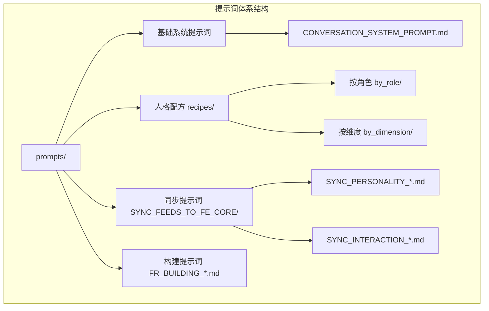
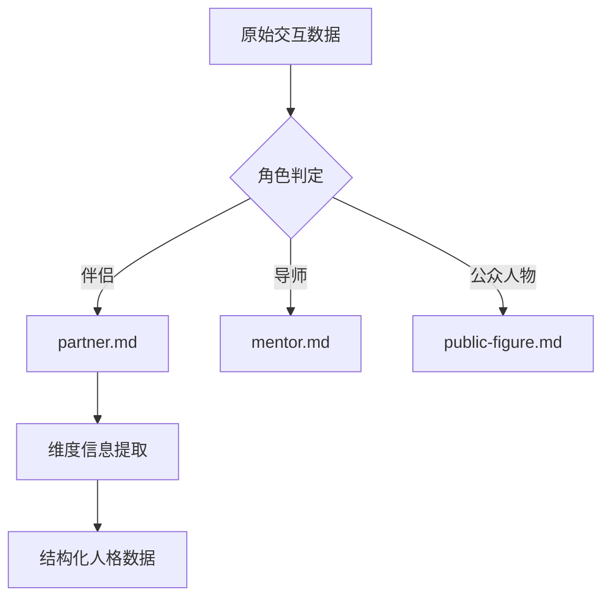
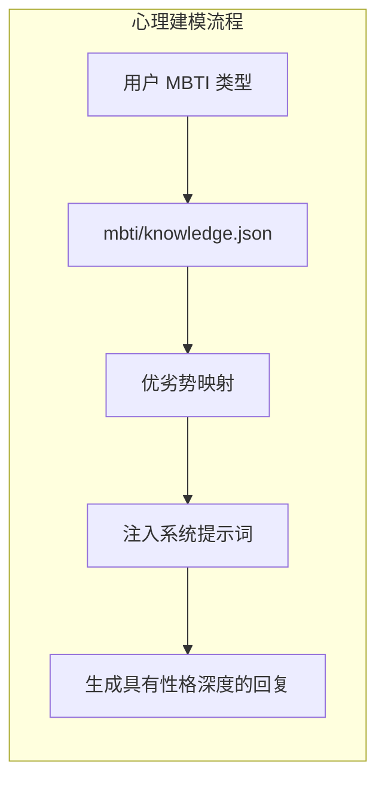
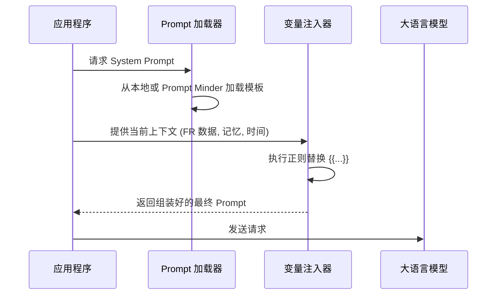
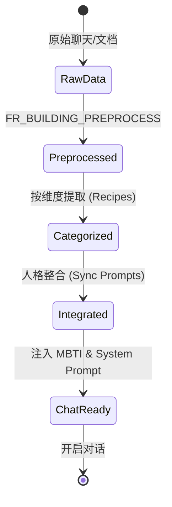
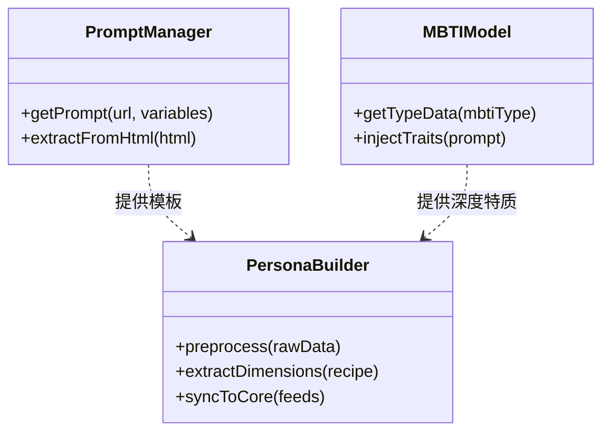

# 人格构建与提示词工程

## 目录
1. [模块概览](#模块概览)
2. [引言](#引言)
3. [Prompt 体系结构](#prompt-体系结构)
4. [人格配方与角色建模](#人格配方与角色建模)
5. [MBTI 与心理深度注入](#mbti-与心理深度注入)
6. [动态 Prompt 组装逻辑](#动态-prompt-组装逻辑)
7. [数字人格构建全生命周期](#数字人格构建全生命周期)
8. [核心组件与实现](#核心组件与实现)
9. [文件引用](#文件引用)

## 模块概览
在 Immortality 项目中，人格构建与提示词工程（Persona Building & Prompt Engineering）是实现“数字孪生”愿景的核心引擎。该模块不仅负责管理复杂的提示词模板，还深度集成了心理学建模（如 MBTI）和动态上下文组装逻辑。

**模块统计数据**：
- **文件总数**：约 35 个核心提示词文件及相关处理逻辑文件。
- **子目录结构**：
    - `prompts/`: 存放所有 Markdown 格式的提示词模板。
    - `prompts/recipes/`: 核心“人格配方”，按角色和维度细分。
    - `prompts/SYNC_FEEDS_TO_FE_CORE/`: 数据同步与整合提示词。
    - `mbti/`: 心理学建模数据，包含知识库、测试题及结果定义。
    - `src/agents/prompt.py`: 动态提示词组装的 Python 实现。

本章节将深入探讨这些组件如何协同工作，将碎片化的原始数据转化为一个具有深度、情感和独特沟通风格的高保真数字人格。

## 引言
数字人格的构建不仅仅是给 AI 设定一个“角色扮演”的指令，而是一个多维度的工程化过程。在 Immortality 中，我们追求的是**高保真（High Fidelity）**，这意味着数字孪生必须能够模仿目标人物的言语习惯、情感反应、价值观取向以及特定的人际关系处理方式。

为了达到这一目标，系统采用了一套分层的提示词体系。从底层的通用系统约束，到中层的角色配方，再到顶层的动态上下文注入，每一层都旨在为 LLM 提供更精确的引导。通过 Prompt Engineering，我们将复杂的心理学模型（MBTI）和海量的历史记忆数据（FR Data）无缝衔接，使得最终生成的回复不仅在逻辑上正确，更在“神态”上契合。

## Prompt 体系结构
提示词体系是数字人格的骨架。在 `prompts/` 目录下，提示词被严密地组织为不同的类别，以应对人格构建的不同阶段。

### 1. 系统提示词 (System Prompts)
系统提示词定义了 AI 的底座行为。例如 `CONVERSATION_SYSTEM_PROMPT.md`，它要求 AI 表现得像一个真实的人，而不是一个 AI 模型。它规定了语言一致性、回复节奏（如拆分为 1-3 条消息）以及对记忆库的使用原则。

### 2. 任务提示词 (Task Prompts)
这些提示词用于特定的后台任务，如 `FR_BUILDING_PREPROCESS.md`。它们指导 LLM 如何从原始聊天记录或文档中清洗、提取有价值的人格碎片。这些任务提示词通常具有极高的严谨性，要求输出严格的 JSON 格式。

### 3. 同步与整合提示词 (Sync Prompts)
位于 `prompts/SYNC_FEEDS_TO_FE_CORE/` 目录下。这些提示词负责将不同来源、不同维度的信息碎片（如 personality, interaction_style, memory）整合为一个连贯的个人描述文本。

下图展示了 `prompts/` 目录的逻辑层次结构：



**架构解析**：
这种分层结构允许开发者独立优化每一层。例如，如果我们想让所有的数字人格都变得更幽默，我们只需要修改 `CONVERSATION_SYSTEM_PROMPT.md`；如果我们想针对“导师”角色优化其指导风格，则只需修改 `recipes/by_role/mentor.md`。这种解耦设计极大地提升了系统的可扩展性和维护性。

**Section sources**:
- [prompts/](file:///Users/bytedance/Desktop/work/Immortality/prompts)
- [prompts/CONVERSATION_SYSTEM_PROMPT.md](file:///Users/bytedance/Desktop/work/Immortality/prompts/CONVERSATION_SYSTEM_PROMPT.md)

## 人格配方与角色建模
“人格配方”（Recipes）是 Immortality 的独创设计，它定义了不同社会角色在数字孪生系统中的表现准则。

### 角色配方的组成
以 `prompts/recipes/by_role/partner.md` 为例，一个典型的角色配方包含以下核心要素：
- **角色范围**：定义了该角色适用的语境（如亲密关系、前任互动）。
- **维度优先级**：规定了在构建人格时，哪些维度的信息应被优先考虑（如 `interaction_style` > `personality`）。
- **补充约束**：针对特定维度的细化要求。例如，对于伴侣角色，`personality` 维度需关注“安全感来源”和“分歧处理倾向”。
- **输出规范**：确保提取的信息能够被系统下游完美解析。

### 动态角色适配
系统根据用户与目标人物的关系，动态选择对应的配方。



通过这种方式，同一个底座模型在加载不同的配方后，能够表现出截然不同的性格特质。例如，“伴侣”配方会引导模型表现出更多的情感波动和细腻关心，而“导师”配方则会强调逻辑性、启发式提问和专业边界。

**代码示例：配方中的维度约束**
```markdown
## 对维度分支的补充约束

- `personality`：关注亲密关系中的稳定倾向、安全感来源、边界与分歧处理倾向。
- `interaction_style`：重点抽取表达关心方式、冲突沟通方式、沉默与回避模式、关系节奏变化。
```

**Section sources**:
- [prompts/recipes/by_role/partner.md](file:///Users/bytedance/Desktop/work/Immortality/prompts/recipes/by_role/partner.md)

## MBTI 与心理深度注入
为了让数字人格具有心理学意义上的深度，Immortality 引入了 MBTI（Myers-Briggs Type Indicator）建模。

### MBTI 知识库的结构
在 `mbti/knowledge.json` 中，系统存储了 16 种人格类型的详尽描述。每种类型都被拆解为：
- **核心描述**：性格本质、思维方式、社交困境。
- **优势 (Pros)**：在职业、成长、关系中的表现。
- **劣势 (Cons)**：潜在的短板和负面倾向。

### 心理映射逻辑
当系统确定了目标人物的 MBTI 类型后，会将这些特质注入到 Prompt 中。这不仅仅是简单的文本堆砌，而是作为一种“潜在变量”影响 LLM 的决策逻辑。



例如，如果一个数字人格被设定为 `INTJ`（建筑师），系统会从知识库中提取其“求知若渴”、“独立不羁”以及“不擅长表达温情”等特质。在回复用户时，LLM 会下意识地减少感性词汇，增加逻辑分析，甚至在面临社交冲突时表现出典型的 `INTJ` 式冷淡或理性。

**Section sources**:
- [mbti/knowledge.json](file:///Users/bytedance/Desktop/work/Immortality/mbti/knowledge.json)

## 动态 Prompt 组装逻辑
静态的提示词模板无法满足千变万化的对话需求。`src/agents/prompt.py` 承担了将模板转化为最终指令的任务。

### 1. 变量替换机制
系统使用 `{{variable_name}}` 占位符。在组装时，`prompt.py` 会读取当前的上下文（如 `user_name`, `current_timestamp`, `words_to_user`）并进行正则替换。

### 2. Prompt Minder 集成
项目支持从外部平台（如 Prompt Minder）动态获取提示词。这允许开发者在不修改代码的情况下，通过 Web 界面快速迭代提示词逻辑。

```python
def extractPromptFromPromptMinder(html: str, variables: dict | None = None) -> Optional[str]:
    # ... 提取逻辑 ...
    if variables:
        for k, v in variables.items():
            val = "" if v is None else str(v)
            pattern = re.compile(r"{{\s*" + re.escape(k) + r"\s*}}")
            result = pattern.sub(lambda _: val, result)
    return result
```

### 3. 组装流程图
提示词的组装是一个从通用到特殊的过程：



这种动态组装逻辑确保了每一个回复都是基于最新的“数字人格状态”生成的。如果目标人物最近产生了一段新的记忆，这段记忆会立即通过变量注入到 Prompt 中，从而在对话中体现出来。

**Section sources**:
- [src/agents/prompt.py](file:///Users/bytedance/Desktop/work/Immortality/src/agents/prompt.py)

## 数字人格构建全生命周期
构建一个高保真的数字人格需要经历从“数据清洗”到“人格同步”的完整生命周期。

### 1. 预处理阶段 (Preprocess)
使用 `FR_BUILDING_PREPROCESS.md` 将乱序的聊天记录转化为结构化的事实片断。这一步是去除噪音、保留核心信息的关键。

### 2. 维度提取阶段 (Extraction)
根据角色配方（Recipes），将信息归类到 `personality`, `interaction_style`, `memory` 等维度。

### 3. 同步与整合阶段 (Sync)
使用 `SYNC_PERSONALITY_FEEDS_TO_FR_CORE.md` 将碎片化的维度信息聚合为一段流畅的人格描述。



在这个过程中，提示词工程扮演了“加工准则”的角色。每一个阶段的提示词都经过精心设计，以确保信息在传递过程中不丢失精度，同时又能被 LLM 深刻理解。

**Section sources**:
- [prompts/FR_BUILDING_PREPROCESS.md](file:///Users/bytedance/Desktop/work/Immortality/prompts/FR_BUILDING_PREPROCESS.md)
- [prompts/SYNC_FEEDS_TO_FE_CORE/SYNC_PERSONALITY_FEEDS_TO_FR_CORE.md](file:///Users/bytedance/Desktop/work/Immortality/prompts/SYNC_FEEDS_TO_FE_CORE/SYNC_PERSONALITY_FEEDS_TO_FR_CORE.md)

## 核心组件与实现
本模块的实现依赖于几个关键的文件和类。

### 1. `src/agents/prompt.py`
负责提示词的加载、解析和变量替换。它是连接提示词模板和运行时数据的桥梁。

### 2. `prompts/CONVERSATION_SYSTEM_PROMPT.md`
定义了对话的“灵魂”。它不仅规定了 AI 的身份，还包含了一些高级技巧，如：
- **语气模仿**：通过 `{{words_to_user}}` 变量注入真实的言语风格。
- **回复节奏控制**：要求 AI 像真人一样分段发消息，而不是一次性输出长篇大论。

### 3. `mbti/knowledge.json`
作为心理学知识库，它为 LLM 提供了关于人类性格多样性的深层参考。



**Section sources**:
- [src/agents/prompt.py](file:///Users/bytedance/Desktop/work/Immortality/src/agents/prompt.py)
- [prompts/CONVERSATION_SYSTEM_PROMPT.md](file:///Users/bytedance/Desktop/work/Immortality/prompts/CONVERSATION_SYSTEM_PROMPT.md)

## 文件引用
以下是本章节涉及的核心文件列表：

- **核心逻辑实现**：
    - [src/agents/prompt.py](file:///Users/bytedance/Desktop/work/Immortality/src/agents/prompt.py) — 动态 Prompt 组装
- **关键提示词模板**：
    - [prompts/CONVERSATION_SYSTEM_PROMPT.md](file:///Users/bytedance/Desktop/work/Immortality/prompts/CONVERSATION_SYSTEM_PROMPT.md) — 基础系统提示词
    - [prompts/FR_BUILDING_PREPROCESS.md](file:///Users/bytedance/Desktop/work/Immortality/prompts/FR_BUILDING_PREPROCESS.md) — 数据预处理
    - [prompts/SYNC_FEEDS_TO_FE_CORE/SYNC_PERSONALITY_FEEDS_TO_FR_CORE.md](file:///Users/bytedance/Desktop/work/Immortality/prompts/SYNC_FEEDS_TO_FE_CORE/SYNC_PERSONALITY_FEEDS_TO_FR_CORE.md) — 人格同步
- **人格配方 (Recipes)**：
    - [prompts/recipes/by_role/partner.md](file:///Users/bytedance/Desktop/work/Immortality/prompts/recipes/by_role/partner.md) — 伴侣角色配方
    - [prompts/recipes/by_dimension/personality.md](file:///Users/bytedance/Desktop/work/Immortality/prompts/recipes/by_dimension/personality.md) — 人格维度配方
- **心理学建模**：
    - [mbti/knowledge.json](file:///Users/bytedance/Desktop/work/Immortality/mbti/knowledge.json) — MBTI 知识库
