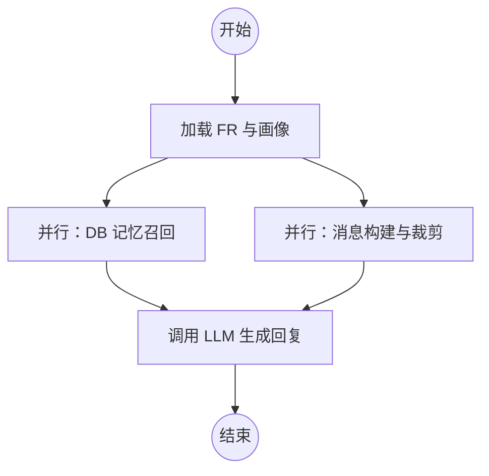
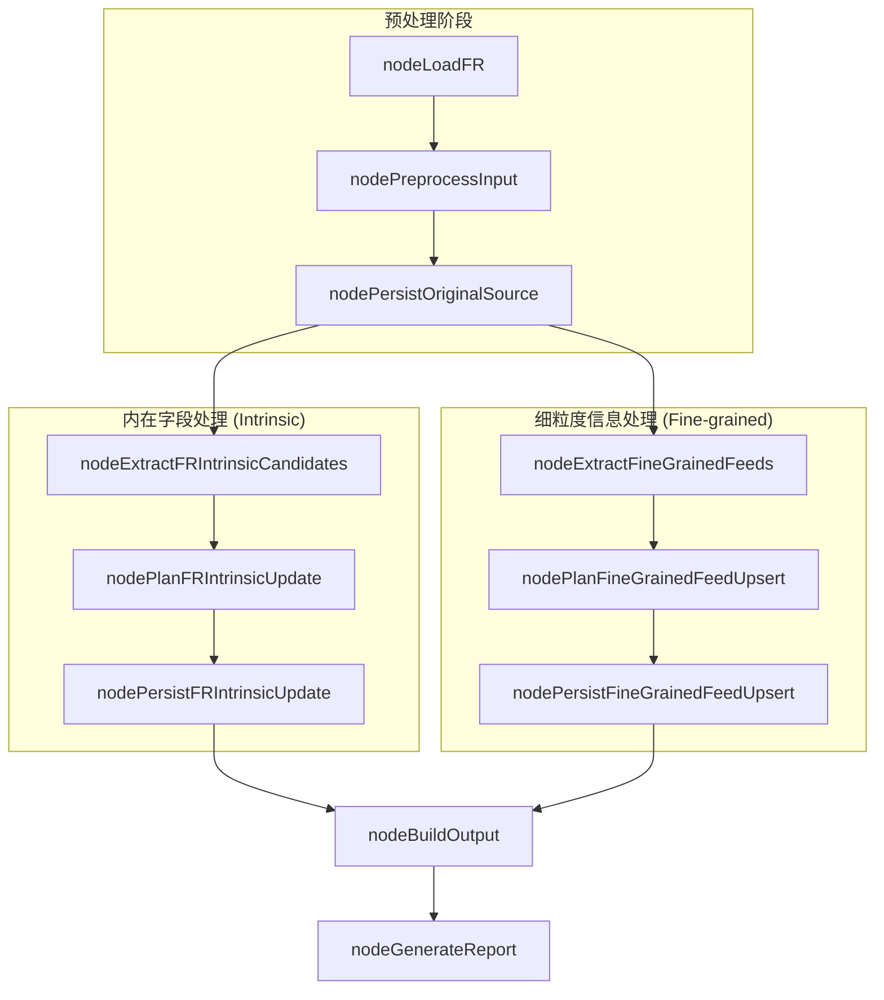

# 代理图设计与工作流

## 目录
1. [模块概览](#模块概览)
2. [设计目标与图结构优势](#设计目标与图结构优势)
3. [ConversationGraph：对话交互核心](#conversationgraph对话交互核心)
   - [状态定义与输入输出](#状态定义与输入输出)
   - [节点功能与执行流](#节点功能与执行流)
   - [短期记忆管理：裁剪与滚动摘要](#短期记忆管理裁剪与滚动摘要)
4. [FRBuildingGraph：人格构建流水线](#frbuildinggraph人格构建流水线)
   - [处理流程详解](#处理流程详解)
   - [内在字段与细粒度信息的并行处理](#内在字段与细粒度信息的并行处理)
   - [冲突解决与报告生成](#冲突解决与报告生成)
5. [状态管理与 Checkpointer](#状态管理与-checkpointer)
   - [持久化机制](#持久化机制)
   - [序列化与自定义类型支持](#序列化与自定义类型支持)
6. [核心组件与代码示例](#核心组件与代码示例)
7. [关键源文件引用](#关键源文件引用)

## 模块概览

`src/agents/graphs` 模块是 Immortality 项目的“大脑”，负责定义代理（Agent）的决策逻辑和业务流程。该模块采用 **LangGraph** 框架，将复杂的业务逻辑抽象为有向图结构，确保了代理行为的可预测性、可观测性和可扩展性。

**模块统计信息**：
- **文件总数**：7 个核心 Python 文件。
- **子模块**：
  - `ConversationGraph`：处理用户与数字生命之间的多轮对话交互。
  - `FRBuildingGraph`：处理原始语料，构建和更新数字生命的人格模型（FR Model）。
- **覆盖范围**：本章节将深度解析这两个核心图的设计模式、节点逻辑以及底层的状态持久化机制。

## 设计目标与图结构优势

在构建复杂的 AI 代理时，传统的线性逻辑往往难以应对多轮对话中的状态切换、记忆检索和长流程的任务处理。Immortality 选择图结构（Graph-based Architecture）作为核心设计模式，主要基于以下目标：

1.  **确定性与可控性**：通过显式定义的节点（Node）和边（Edge），开发者可以精确控制模型在不同阶段的行为，避免了纯 ReAct 代理可能出现的“逻辑幻觉”。
2.  **高度的灵活性**：图结构允许并行执行（如同时进行记忆检索和消息预处理）和条件分支，极大地提升了系统的响应效率。
3.  **状态持久化（Statefulness）**：利用 LangGraph 的 Checkpointer 机制，系统可以轻松实现对话状态的断点恢复，支持超长周期的交互。
4.  **清晰的可观测性**：每一轮执行的路径、每个节点的输入输出都可以被记录和追踪，便于调试和性能优化。

## ConversationGraph：对话交互核心

`ConversationGraph` 负责处理用户与数字生命（Figure）之间的实时对话。它不仅要生成符合人设的回复，还要负责长期记忆的召回和短期记忆的管理。

### 状态定义与输入输出

对话图的状态由 `ConversationGraphState` 定义，它继承自 `MessagesState`，自动支持消息列表的增量合并。

```python
class ConversationGraphState(MessagesState):
    round_uuid: str  # 本轮次唯一标识
    request: Request # 包含 user_id, fr_id, messages_received
    user_name: str
    figure_persona: str
    words_to_user: str # 核心人设话术
    
    # 召回的各类信息
    recalled_procedural_infos_from_db: str
    recalled_memories_from_db: str
    
    conversation_summary: str  # 滚动摘要
    logs: Annotated[list[NodeLog], _mergeUniqueList]
    status: Literal["running", "failed", "completed"]
    llm_output: LLMOutput
```

### 节点功能与执行流

对话图采用了“先加载、再并行处理、最后生成”的结构。

下面的流程图展示了 `ConversationGraph` 的执行逻辑：



**执行流说明**：
1.  **nodeLoadFRAndPersona**：根据请求中的 `fr_id` 加载数字生命的基本画像、人设话术以及用户信息。
2.  **并行分支**：
    -   **nodeRecallFeedsFromDB**：根据用户本轮输入，从向量数据库中召回相关的“程序性知识”和“人生经历”。
    -   **nodeBuildAndTrimMessage**：将新消息加入历史，并检查是否触发短期记忆裁剪。
3.  **nodeCallLLM**：组装系统提示词（System Prompt）、人物画像、召回记忆、对话摘要以及修剪后的消息历史，调用大模型生成最终回复。

### 短期记忆管理：裁剪与滚动摘要

为了在有限的上下文窗口内保留尽可能多的有效信息，`ConversationGraph` 实现了一套精细的短期记忆管理机制：

-   **按轮次裁剪**：当消息总字符数或条数超过阈值时，系统会从最早的轮次开始裁剪。
-   **滚动摘要**：被裁掉的消息不会被简单丢弃，而是由一个轻量级模型（Mini Model）结合旧摘要，总结成新的 `conversation_summary`。
-   **原子性保证**：裁剪时以 `round_uuid` 为单位，确保同一轮对话中的 Human 和 AI 消息被整体保留或整体移除。

**Diagram sources**: 
- [src/agents/graphs/ConversationGraph/graph.py:L24-L45](file:///Users/bytedance/Desktop/work/Immortality/src/agents/graphs/ConversationGraph/graph.py#L24-L45)
- [src/agents/graphs/ConversationGraph/nodes.py:L97-L189](file:///Users/bytedance/Desktop/work/Immortality/src/agents/graphs/ConversationGraph/nodes.py#L97-L189)

## FRBuildingGraph：人格构建流水线

`FRBuildingGraph` 是一个复杂的离线/异步任务流，用于将散乱的原始语料（文字、图片）转化为结构化的数字生命人格数据。

### 处理流程详解

该图的设计采用了典型的“提取-计划-持久化”模式。



### 内在字段与细粒度信息的并行处理

人格构建被拆分为两个并行的核心路径：

1.  **内在字段（Intrinsic Fields）**：处理如 MBTI、生日、职业、居住地等核心属性。
    -   **提取**：从语料中识别这些属性的候选值。
    -   **计划**：使用 LLM 将新值与旧值对比。如果是 MBTI 这种单一属性，则进行覆盖；如果是列表属性（如爱好），则进行合并。
2.  **细粒度信息（Fine-grained Feeds）**：处理如“人生经历”、“思维方式”、“沟通风格”等更具语义深度的信息。
    -   **提取**：按维度（Dimension）并行调用 LLM 进行信息抽取。
    -   **计划**：对每一条新抽取的信息，先从 DB 中召回相似的旧信息，再由 LLM 判断是“补充”、“冲突”还是“重复”。

### 冲突解决与报告生成

当新旧信息发生冲突时，系统目前采用“记录冲突并更新”的策略，即将冲突详情记入 `fine_grained_feed_conflict` 表，同时暂时采用新信息以保持时效性。

最后，`nodeGenerateFRBuildingReport` 会汇总本轮所有的变更日志，生成一份人类可读的 Markdown 报告，详细说明“由于收到了什么新语料，我们更新了数字生命的哪些人格特质”。

**Diagram sources**: 
- [src/agents/graphs/FRBuildingGraph/graph.py:L30-L69](file:///Users/bytedance/Desktop/work/Immortality/src/agents/graphs/FRBuildingGraph/graph.py#L30-L69)
- [src/agents/graphs/FRBuildingGraph/nodes.py:L51-L101](file:///Users/bytedance/Desktop/work/Immortality/src/agents/graphs/FRBuildingGraph/nodes.py#L51-L101)

## 状态管理与 Checkpointer

为了支持多轮对话的连续性和长任务的可靠性，模块在 `checkpointer.py` 中封装了底层的持久化逻辑。

### 持久化机制

系统使用 PostgreSQL 作为状态存储后端（`PostgresSaver` 和 `AsyncPostgresSaver`）。

-   **同步与异步支持**：提供了 `getCheckpointer` 和 `agetCheckpointer` 两个单例获取函数，分别适配同步和异步的 Graph 执行环境。
-   **自动 Setup**：在首次获取 Checkpointer 时，会自动执行 `setup()` 方法，确保数据库表结构（如 `checkpoints` 和 `writes`）正确创建。

### 序列化与自定义类型支持

由于 Graph State 中包含大量的自定义 Enum 类型（如 `MBTI`, `FigureRole`, `FineGrainedFeedDimension`），标准的 JSON 序列化无法处理。

模块使用了 `JsonPlusSerializer` 并显式注册了这些自定义类型，确保状态在存入数据库和从数据库读取时能正确还原为 Python 对象。

```python
_checkpoint_serde = JsonPlusSerializer(
    allowed_msgpack_modules=[
        FigureRole,
        Gender,
        MBTI,
        FineGrainedFeedDimension,
        FineGrainedFeedConfidence,
        ConflictStatus,
    ]
)
```

## 核心组件与代码示例

以下是构建 `ConversationGraph` 的核心工厂函数示例，展示了如何配置节点、边以及 Checkpointer。

```python
def buildBaseConversationGraph() -> StateGraph:
    # 1. 初始化图并定义 Schema
    graph = StateGraph(
        state_schema=ConversationGraphState,
        input_schema=ConversationGraphInput,
        output_schema=ConversationGraphOutput,
    )

    # 2. 添加处理节点
    graph.add_node("nodeLoadFRAndPersona", nodeLoadFRAndPersona)
    graph.add_node("nodeRecallFeedsFromDB", nodeRecallFeedsFromDB)
    graph.add_node("nodeBuildAndTrimMessage", nodeBuildAndTrimMessage)
    graph.add_node("nodeCallLLM", nodeCallLLM)

    # 3. 定义执行拓扑
    graph.add_edge(START, "nodeLoadFRAndPersona")
    
    # 并行执行记忆召回和消息裁剪
    graph.add_edge("nodeLoadFRAndPersona", "nodeRecallFeedsFromDB")
    graph.add_edge("nodeLoadFRAndPersona", "nodeBuildAndTrimMessage")
    
    # 汇总到 LLM 调用节点
    graph.add_edge("nodeRecallFeedsFromDB", "nodeCallLLM")
    graph.add_edge("nodeBuildAndTrimMessage", "nodeCallLLM")
    graph.add_edge("nodeCallLLM", END)

    return graph

async def buildConversationGraphWithMemory() -> CompiledStateGraph:
    graph = buildBaseConversationGraph()
    # 注入异步持久化组件
    checkpointer = await agetCheckpointer()
    return graph.compile(checkpointer=checkpointer)
```

## 关键源文件引用

**Section sources**:
- [src/agents/graphs/ConversationGraph/graph.py](file:///Users/bytedance/Desktop/work/Immortality/src/agents/graphs/ConversationGraph/graph.py)
- [src/agents/graphs/ConversationGraph/nodes.py](file:///Users/bytedance/Desktop/work/Immortality/src/agents/graphs/ConversationGraph/nodes.py)
- [src/agents/graphs/ConversationGraph/state.py](file:///Users/bytedance/Desktop/work/Immortality/src/agents/graphs/ConversationGraph/state.py)
- [src/agents/graphs/FRBuildingGraph/graph.py](file:///Users/bytedance/Desktop/work/Immortality/src/agents/graphs/FRBuildingGraph/graph.py)
- [src/agents/graphs/FRBuildingGraph/nodes.py](file:///Users/bytedance/Desktop/work/Immortality/src/agents/graphs/FRBuildingGraph/nodes.py)
- [src/agents/graphs/FRBuildingGraph/state.py](file:///Users/bytedance/Desktop/work/Immortality/src/agents/graphs/FRBuildingGraph/state.py)
- [src/agents/graphs/checkpointer.py](file:///Users/bytedance/Desktop/work/Immortality/src/agents/graphs/checkpointer.py)
