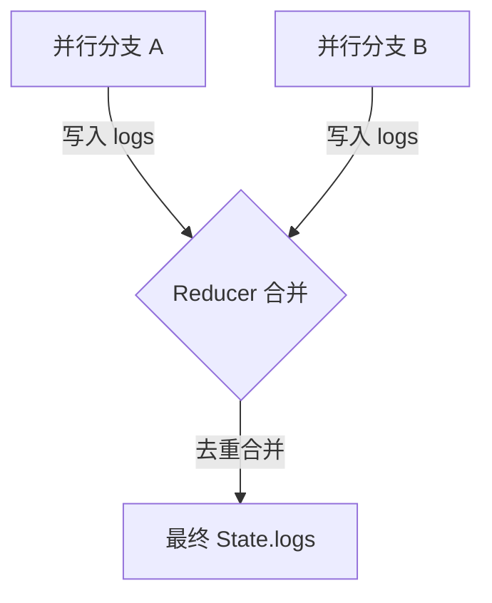
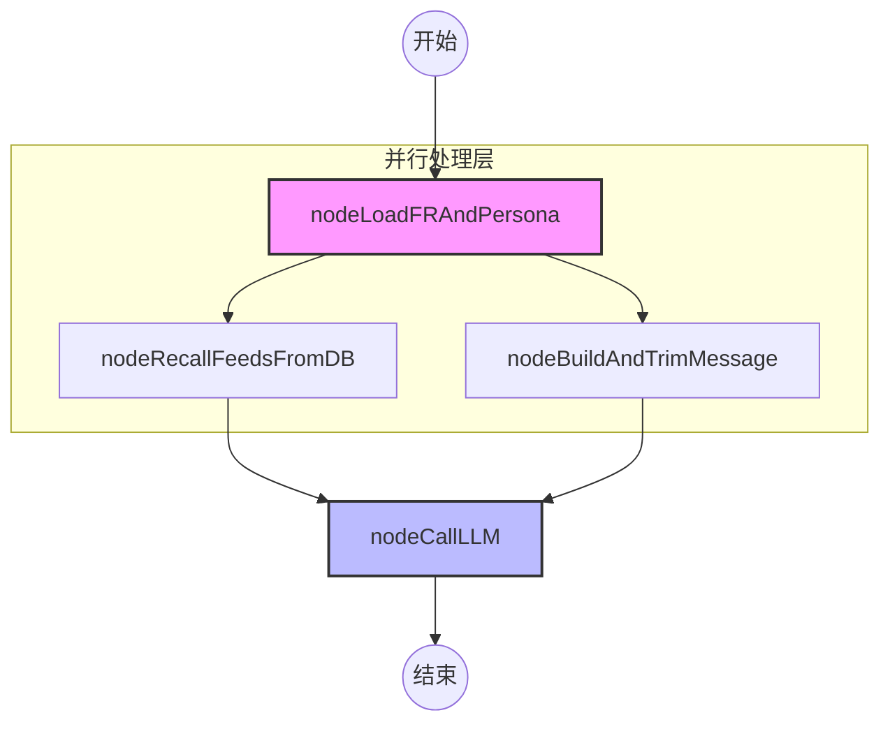
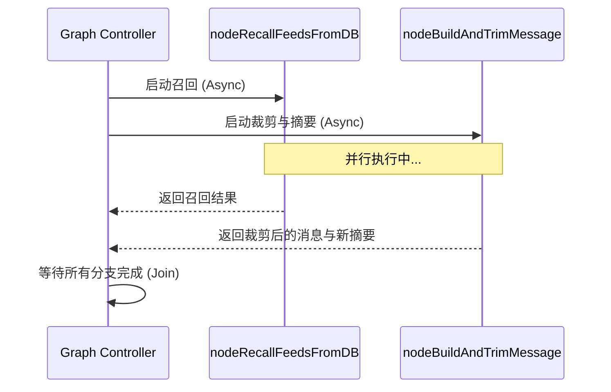
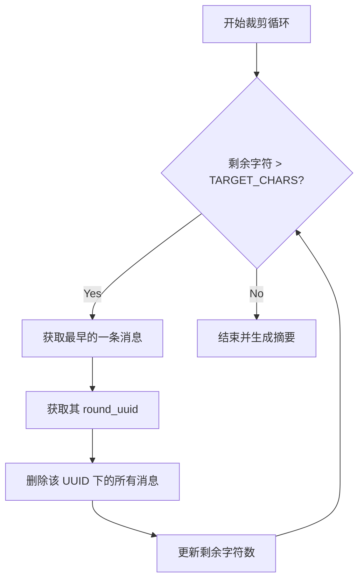

# ConversationGraph 对话工作流

## 目录
1. [模块概览](#模块概览)
2. [引言](#引言)
3. [状态定义与管理](#状态定义与管理)
   - [ConversationGraphState 深度解析](#conversationgraphstate-深度解析)
   - [状态合并机制](#状态合并机制)
4. [工作流架构](#工作流架构)
   - [图结构定义](#图结构定义)
   - [执行流向分析](#执行流向分析)
5. [核心节点逻辑解析](#核心节点逻辑解析)
   - [nodeLoadFRAndPersona：初始化与上下文加载](#nodeloadfrandpersona初始化与上下文加载)
   - [nodeRecallFeedsFromDB：知识检索机制](#noderecallfeedsfromdb知识检索机制)
   - [nodeBuildAndTrimMessage：短期记忆管理](#nodebuildandtrimmessage短期记忆管理)
   - [nodeCallLLM：最终生成与输出处理](#nodecallllm最终生成与输出处理)
6. [并行执行机制](#并行执行机制)
   - [并行设计初衷](#并行设计初衷)
   - [性能提升分析](#性能提升分析)
7. [短期记忆与滚动摘要算法](#短期记忆与滚动摘要算法)
   - [裁剪触发策略](#裁剪触发策略)
   - [按轮次裁剪（round_uuid）](#按轮次裁剪round_uuid)
   - [滚动摘要生成流程](#滚动摘要生成流程)
8. [提示词工程与上下文组装](#提示词工程与上下文组装)
   - [Prompt 层次结构](#prompt-层次结构)
   - [上下文注入优先级](#上下文注入优先级)
9. [错误处理与日志追踪](#错误处理与日志追踪)
   - [节点日志记录](#节点日志记录)
   - [重试与容错机制](#重试与容错机制)
10. [工程取舍与性能优化](#工程取舍与性能优化)
11. [核心组件代码示例](#核心组件代码示例)
12. [文件参考](#文件参考)

## 模块概览

`ConversationGraph` 是 Immortality 系统中处理实时对话的核心引擎。它基于 LangGraph 框架构建，通过有向无环图（DAG）的形式组织复杂的对话逻辑，包括身份加载、知识检索、记忆裁剪以及大模型调用。

**模块统计信息：**
- **总文件数**：4 个核心文件
- **核心目录**：`src/agents/graphs/ConversationGraph/`
- **主要子模块**：
  - **状态模型 (`state.py`)**：定义了图中流转的所有数据结构。
  - **节点实现 (`nodes.py`)**：包含了所有的业务逻辑处理单元。
  - **图定义 (`graph.py`)**：负责节点的编排、连接以及编译。
  - **文档说明 (`README.md`)**：提供了设计思路与 FAQ。

本页面将全方位覆盖该目录下的所有代码实现，深入探讨其背后的设计哲学与工程实践。

## 引言

在构建高度拟人化的 AI 角色时，单纯的 Prompt Engineering 往往难以应对长期的、复杂的对话场景。`ConversationGraph` 的出现正是为了解决以下核心痛点：

1. **上下文爆炸**：随着对话轮次的增加，Token 消耗呈线性增长，且模型处理长文本的能力会逐渐下降。
2. **记忆碎片化**：如何从海量的历史记忆中精准召回与当前语境相关的信息，并有机地融入对话。
3. **响应稳定性**：在复杂的业务逻辑（如多路并行、错误重试）中保持状态的一致性。

`ConversationGraph` 通过引入“短期记忆裁剪”与“滚动摘要”机制，配合“并行检索”策略，确保了系统在高性能的前提下，依然能提供极具深度和连贯性的对话体验。

## 状态定义与管理

状态（State）是 LangGraph 的灵魂。在 `ConversationGraph` 中，所有节点都共享并修改同一个状态对象 `ConversationGraphState`。

### ConversationGraphState 深度解析

`ConversationGraphState` 继承自 LangGraph 的 `MessagesState`，这意味着它天然支持 `messages` 字段的自动追加（Append）语义。

```python
class ConversationGraphState(MessagesState):
    round_uuid: str  # 本轮次唯一标识 uuid
    request: Request # 包含 user_id, fr_id, messages_received
    user_name: str  # 用户姓名
    figure_persona: str  # 人物画像 Markdown
    words_to_user: str  # 角色对用户的特定称呼或习惯用语
    
    # 召回结果
    recalled_procedural_infos_from_db: str # 程序性知识
    recalled_memories_from_db: str # 长期记忆
    
    # 记忆管理
    conversation_summary: str  # 滚动摘要
    
    # 链路追踪
    logs: Annotated[list[NodeLog], _mergeUniqueList]
    warnings: Annotated[list[str], _mergeUniqueList]
    errors: Annotated[list[str], _mergeUniqueList]
    
    # 输出结果
    llm_output: LLMOutput
```

**核心字段说明：**
- **`round_uuid`**：这是本轮对话的唯一标识，用于将 `HumanMessage` 和随后的 `AIMessage` 绑定在一起。在后续的裁剪逻辑中，它确保了同一轮次的对话不会被拆散。
- **`conversation_summary`**：承载了被裁剪掉的历史消息的精华。它不是以对话形式存在，而是作为一种“背景知识”注入模型。
- **`logs/warnings/errors`**：使用了自定义的 `_mergeUniqueList` 减法器（Reducer），确保在并行分支中写入的日志能够被正确合并。

### 状态合并机制

由于图中存在并行分支，多个节点可能会同时尝试修改同一个状态字段。`ConversationGraph` 通过 `Annotated` 和自定义合并函数解决了这一冲突。



这种设计保证了即使在复杂的并行拓扑中，系统的可观测性数据（日志）也不会丢失或产生冗余。

**Section sources**:
- [state.py](file:///Users/bytedance/Desktop/work/Immortality/src/agents/graphs/ConversationGraph/state.py)

## 工作流架构

`ConversationGraph` 的结构设计遵循“先准备，后执行”的原则。

### 图结构定义

图的起点是 `nodeLoadFRAndPersona`，它负责准备所有基础上下文。随后，图分裂为两个并行分支：一个负责从数据库召回深度背景知识，另一个负责处理当前的对话历史与记忆裁剪。



### 执行流向分析

1. **初始化阶段**：`nodeLoadFRAndPersona` 加载用户和角色的基础信息，并生成 `round_uuid`。这是整个流程的“锚点”。
2. **并行准备阶段**：
   - **知识召回**：`nodeRecallFeedsFromDB` 根据用户输入，去向量数据库寻找最相关的记忆片段。
   - **记忆管理**：`nodeBuildAndTrimMessage` 将本轮输入存入历史，并根据长度限制决定是否需要将更早的消息“压缩”进摘要。
3. **生成阶段**：`nodeCallLLM` 汇总所有信息，构建终极 Prompt，并调用 LLM 生成回复。

这种“扇出-扇入”（Fan-out/Fan-in）的模式极大地提高了系统的吞吐量，因为 I/O 密集型的数据库查询和计算密集型的摘要生成可以同时进行。

**Section sources**:
- [graph.py](file:///Users/bytedance/Desktop/work/Immortality/src/agents/graphs/ConversationGraph/graph.py)

## 核心节点逻辑解析

每个节点都是一个独立的异步函数，负责处理特定的业务逻辑。

### nodeLoadFRAndPersona：初始化与上下文加载

该节点是图的入口。它的主要任务是建立“身份感”。

- **身份校验**：通过 `getFigureAndRelation` 获取角色与用户的关系定义。
- **画像构建**：调用 `buildFigurePersonaMarkdown` 将复杂的角色结构转化为模型易于理解的 Markdown 文本。
- **排除冗余**：显式排除了 `core_procedural_info` 等字段，因为这些信息将由后续的召回节点动态注入，避免 Prompt 冗余。

### nodeRecallFeedsFromDB：知识检索机制

这是一个纯粹的 RAG（Retrieval-Augmented Generation）节点。

- **动态 Query**：将本轮收到的多条消息拼接为检索词。
- **分组召回**：目前专注于 `PROCEDURAL_INFO`（程序性知识，即“ta怎么做事”）和 `MEMORY`（长期记忆，即“ta经历过什么”）。
- **停用低语境字段**：为了保持 Prompt 的精简，系统停用了 `PERSONALITY` 和 `INTERACTION_STYLE` 的动态召回，转而依赖静态画像。

### nodeBuildAndTrimMessage：短期记忆管理

这是系统中最复杂的逻辑节点之一，负责维护对话的“新鲜度”。

- **消息入库**：将用户输入包装为 `HumanMessage`，并打上 `round_uuid` 标签。
- **触发裁剪**：如果消息总长度超过 `SHORT_TERM_MEMORY_MAX_CHARS`（默认 1600 字符），则启动裁剪流程。
- **状态补丁**：注意，该节点返回的是一个“补丁”（Patch），包含 `RemoveMessage` 指令。这体现了 LangGraph 的增量更新思想。

### nodeCallLLM：最终生成与输出处理

所有信息的汇聚点。

- **Prompt 组装**：按照“系统指令 -> 角色画像 -> 召回知识 -> 对话摘要 -> 最近历史”的顺序排列。这种顺序符合模型对注意力权重的分配规律。
- **JSON 强制输出**：通过 `ainvokeJsonWithRetry` 确保模型返回的是结构化数据，方便后端解析。
- **推理内容保留**：支持获取模型的 `reasoning_content`（思维链），但不将其存入对话历史，以节省存储空间。

**Section sources**:
- [nodes.py](file:///Users/bytedance/Desktop/work/Immortality/src/agents/graphs/ConversationGraph/nodes.py)

## 并行执行机制

并行化是 `ConversationGraph` 性能优化的核心手段。

### 并行设计初衷

在传统的线性工作流中，如果数据库查询耗时 200ms，摘要生成耗时 500ms，总耗时将达到 700ms。而在并行模式下，总耗时仅取决于最慢的分支（约 500ms）。



### 性能提升分析

这种设计不仅缩短了首字响应时间（TTFT），还通过将不同类型的任务（I/O vs CPU/GPU）解耦，提高了系统的整体稳定性。即使数据库偶尔波动，也不会阻塞摘要生成逻辑的预热。

## 短期记忆与滚动摘要算法

这是 Immortality 能够支持“无限对话”的关键。

### 裁剪触发策略

系统通过三个关键参数控制裁剪行为：
1. `MAX_CHARS` (1600): 软上限，超过此值触发裁剪。
2. `TARGET_CHARS` (1000): 裁剪目标，裁剪到此值以下停止。
3. `MAX_MESSAGES` (30): 兜底上限，防止消息条数过多。

### 按轮次裁剪（round_uuid）

为了避免在裁剪时将用户的问题与其对应的回答拆开，系统引入了“轮次意识”。



这种“整轮删除”的策略确保了 `conversation_summary` 在生成时，输入的数据是语义完整的。

### 滚动摘要生成流程

被删除的消息不会消失，而是被“压缩”。

1. **提取文本**：将待删除的消息按 `[Role] Content` 格式拼接。
2. **合并旧摘要**：将“旧摘要”与“新消息文本”一起交给 `MINI_MODEL`。
3. **生成新摘要**：模型生成一段简短的叙述，描述这段历史中发生了什么。
4. **注入上下文**：新摘要存入 `conversation_summary` 字段，在下一轮对话中作为 `SystemMessage` 出现。

**Section sources**:
- [nodes.py:L97-L189](file:///Users/bytedance/Desktop/work/Immortality/src/agents/graphs/ConversationGraph/nodes.py#L97-L189)

## 提示词工程与上下文组装

`nodeCallLLM` 中的 Prompt 组装是一门艺术。

### Prompt 层次结构

最终发送给模型的 `messages_to_send` 列表如下：

| 顺序 | 类型 | 内容描述 | 作用 |
| :--- | :--- | :--- | :--- |
| 1 | System | `CONVERSATION_SYSTEM_PROMPT` | 核心指令、时间戳、称呼习惯 |
| 2 | System | `figure_persona` | 角色基础设定、性格、背景 |
| 3 | System | `high_context_depended_feeds` | 动态召回的记忆与知识补充 |
| 4 | System | `conversation_summary` | 更早对话的滚动摘要（可选） |
| 5 | Messages | `short_term_memory` | 最近几轮的原始对话历史 |

### 上下文注入优先级

将 `conversation_summary` 放在原始对话历史之前，是为了让模型意识到这是“过去发生的事”，而 `messages` 则是“正在发生的事”。这种时序上的暗示有助于模型更好地把握对话的节奏。

## 错误处理与日志追踪

在复杂的 Graph 中，调试往往是噩梦。`ConversationGraph` 通过结构化日志解决了这一问题。

### 节点日志记录

每个节点在执行结束前，都会向 `logs` 列表追加一条 `NodeLog`：

```python
logs += [{
    "step": "nodeRecallFeedsFromDB",
    "status": "ok",
    "detail": "Recall fine-grained feeds success",
    "data": { "recalled_count": 5 }
}]
```

### 重试与容错机制

- **LLM 解析重试**：`ainvokeJsonWithRetry` 提供了 2 次重试机会，专门应对模型返回非标准 JSON 的情况。
- **软失败处理**：如果召回节点失败，系统会记录 `error` 但不会中断整个图的执行，而是尝试在缺失部分背景知识的情况下继续对话，保证了系统的高可用性。

## 工程取舍与性能优化

1. **模型分级**：摘要生成使用 `MINI_MODEL`（低成本、高速度），对话生成使用 `LITE_MODEL`（高性能、强推理）。
2. **异步优先**：所有节点均为 `async`，充分利用 Python 的协程能力处理 I/O。
3. **状态极简**：`AIMessage` 中不存储 `reasoning_content`，极大地减小了 Checkpointer 序列化后的存储体积。

## 核心组件代码示例

以下是构建 `ConversationGraph` 的核心代码片段：

```python
def buildBaseConversationGraph() -> StateGraph:
    graph = StateGraph(
        state_schema=ConversationGraphState,
        input_schema=ConversationGraphInput,
        output_schema=ConversationGraphOutput,
    )

    # 添加节点
    graph.add_node("nodeLoadFRAndPersona", nodeLoadFRAndPersona)
    graph.add_node("nodeRecallFeedsFromDB", nodeRecallFeedsFromDB)
    graph.add_node("nodeBuildAndTrimMessage", nodeBuildAndTrimMessage)
    graph.add_node("nodeCallLLM", nodeCallLLM)

    # 定义边
    graph.add_edge(START, "nodeLoadFRAndPersona")
    graph.add_edge("nodeLoadFRAndPersona", "nodeRecallFeedsFromDB")
    graph.add_edge("nodeLoadFRAndPersona", "nodeBuildAndTrimMessage")
    graph.add_edge("nodeRecallFeedsFromDB", "nodeCallLLM")
    graph.add_edge("nodeBuildAndTrimMessage", "nodeCallLLM")
    graph.add_edge("nodeCallLLM", END)

    return graph
```

**Diagram sources**:
- [graph.py:L24-L45](file:///Users/bytedance/Desktop/work/Immortality/src/agents/graphs/ConversationGraph/graph.py#L24-L45)

## 文件参考

本模块涉及的关键源文件如下：

- [graph.py](file:///Users/bytedance/Desktop/work/Immortality/src/agents/graphs/ConversationGraph/graph.py)：图结构定义与编译逻辑。
- [nodes.py](file:///Users/bytedance/Desktop/work/Immortality/src/agents/graphs/ConversationGraph/nodes.py)：节点业务逻辑实现，包含裁剪与召回。
- [state.py](file:///Users/bytedance/Desktop/work/Immortality/src/agents/graphs/ConversationGraph/state.py)：状态 Schema 与合并函数。
- [README.md](file:///Users/bytedance/Desktop/work/Immortality/src/agents/graphs/ConversationGraph/README.md)：模块设计文档与 FAQ。
