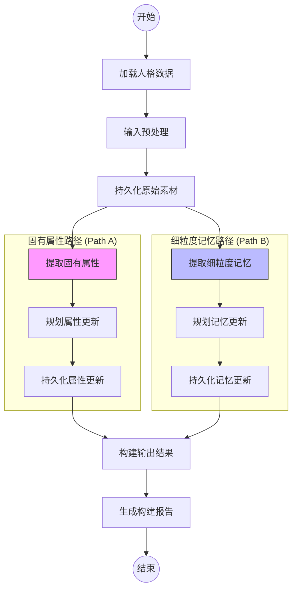
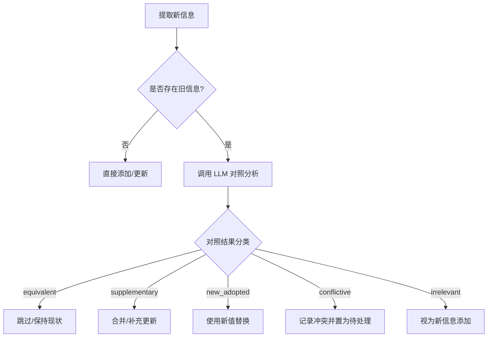

# FRBuildingGraph 人格构建工作流

## 目录
1. [模块概览](#模块概览)
2. [引言](#引言)
3. [核心架构](#核心架构)
4. [数据模型与状态管理](#数据模型与状态管理)
5. [人格建模全流程解析](#人格建模全流程解析)
   - [输入预处理与清洗](#输入预处理与清洗)
   - [双路并行提取策略](#双路并行提取策略)
   - [冲突检测与更新规划](#冲突检测与更新规划)
   - [持久化与落库流程](#持久化与落库流程)
6. [关键逻辑与算法](#关键逻辑与算法)
   - [LLM 字段对照逻辑](#llm-字段对照逻辑)
   - [细粒度信息召回策略](#细粒度信息召回策略)
7. [并发控制与数据一致性](#并发控制与数据一致性)
8. [报告生成机制](#报告生成机制)
9. [文件参考](#文件参考)

## 模块概览

`FRBuildingGraph` 是 Immortality 系统中负责“人格构建”（Figure and Relation Building）的核心组件。它通过对用户提供的原始语料进行深度处理，实现对“数字孪生”人格（Persona）的增量式构建与维护。

该模块位于 `src/agents/graphs/FRBuildingGraph/` 目录下，包含 4 个核心文件：
- `graph.py`: 定义了基于 LangGraph 的复杂工作流拓扑结构。
- `nodes.py`: 实现了工作流中的所有逻辑节点，包括信息提取、规划、对照和持久化。
- `state.py`: 定义了工作流执行过程中的中间状态和数据结构。
- `README.md`: 提供了模块的设计文档和工作流说明。

本章节将深入解析该模块的内部实现，涵盖其双路并行提取架构、复杂的冲突解决策略以及如何确保在大规模并发环境下的数据一致性。

## 引言

在 Immortality 系统中，人格（Figure）的构建并非一蹴而就，而是一个持续吸收新信息、修正旧认知、完善细节的过程。`FRBuildingGraph` 承担了这一“人格进化”的重任。其核心任务是将非结构化的原始文本或图片内容，转化为结构化的人格属性（Intrinsic Properties）和半结构化的细粒度记忆片段（Fine-Grained Feeds）。

### 核心术语
- **FR (Figure and Relation)**: 人格及其与用户的关系模型，包含 MBTI、职业、背景等固有属性。
- **Original Source**: 原始素材，指用户输入的原始文本或图片经过初步清洗后的中间表示。
- **Fine-Grained Feed**: 细粒度信息，指关于人格的特定事件、偏好、习惯或记忆片段。
- **Intrinsic Attributes**: 固有属性，如生日、教育背景、性格特征等。

## 核心架构

`FRBuildingGraph` 采用了基于 LangGraph 的有向无环图（DAG）架构。其设计精髓在于“先顺序预处理，后双路并行提取，最后汇总报告”的流水线模式。

下图展示了 `FRBuildingGraph` 的完整执行流向：



**架构解析**：
该工作流首先通过 `nodeLoadFR` 和 `nodePreprocessInput` 对输入进行标准化处理。随后，流程进入最关键的并行阶段：
1. **固有属性路径**：专注于人格的宏观画像，如 MBTI 的变化或背景信息的补充。
2. **细粒度记忆路径**：专注于人格的微观细节，如特定的生活习惯或过往经历。
这种并行设计不仅提高了处理效率，还实现了逻辑上的解耦，使得不同类型的信息提取可以采用不同的 LLM 提示词策略。最后，所有更新结果在 `nodeBuildOutput` 汇总，并由 LLM 生成一份人类可读的进度报告。

**Diagram sources**: 
- [graph.py:L30-L69](file:///Users/bytedance/Desktop/work/Immortality/src/agents/graphs/FRBuildingGraph/graph.py#L30-L69)

## 数据模型与状态管理

`FRBuildingGraph` 的状态管理由 `state.py` 中定义的 `FRBuildingGraphState` 承载。它是一个典型的 `TypedDict`，在节点间传递并逐步累积处理结果。

### 核心状态结构

```python
class FRBuildingGraphState(TypedDict, total=False):
    request: Request                # 初始请求，包含用户ID、FR ID和原始内容
    figure_and_relation: dict       # 当前数据库中的人格完整数据
    original_source: OriginalSourceTemp # 预处理后的素材
    fr_intrinsic_updates: FRIntrinsicUpdates # 待更新的固有属性
    extracted_feeds: list[ExtractedFineGrainedFeed] # 提取出的细粒度记忆片段
    feed_upsert_plan: list[FeedUpsertPlanItem] # 细粒度信息的更新/冲突计划
    logs: Annotated[list[NodeLog], _mergeUniqueList] # 节点执行日志（支持并行合并）
    # ... 其他辅助状态
```

**状态管理细节**：
- **日志合并机制**：由于存在并行路径，`logs` 字段使用了 `Annotated` 配合 `_mergeUniqueList` 减速器。这确保了当两个并行分支同时向 `logs` 写入数据时，列表能够正确合并而不会发生覆盖。
- **渐进式累积**：每个节点只负责更新其职责范围内的状态字段。例如，`nodeExtractFineGrainedFeeds` 只负责填充 `extracted_feeds`。

**Section sources**:
- [state.py:L86-L104](file:///Users/bytedance/Desktop/work/Immortality/src/agents/graphs/FRBuildingGraph/state.py#L86-L104)

## 人格建模全流程解析

### 输入预处理与清洗

`nodePreprocessInput` 是流水线的第一个逻辑关口。它的任务是将凌乱的用户输入（可能包含废话、重复内容或格式错误）转化为干净的、可供后续提取使用的 `OriginalSource`。

**处理逻辑**：
1. **内容校验**：检查输入是否为空或过短（少于 10 个字符），若不符合要求则抛出错误中断流程。
2. **LLM 清洗**：调用 `LITE_MODEL` 结合 `FR_BUILDING_PREPROCESS` 提示词。LLM 会识别内容的来源类型（如社交媒体、对话记录、日记等）、置信度以及涉及的人格维度。
3. **结构化输出**：LLM 返回 `cleaned_content` 和 `metadata`。其中 `metadata` 包含了 `included_dimensions`，这决定了后续细粒度提取阶段会触发哪些维度的 Prompt。

### 双路并行提取策略

在 `nodePersistOriginalSource` 完成后，系统会同时启动两条提取路径：

#### 1. 固有属性提取 (`nodeExtractFRIntrinsicCandidates`)
此路径专注于提取 `FigureAndRelation` 表中的核心字段。它使用专门的提示词从清洗后的内容中寻找明确提及或可显然推断的属性，如：
- **基本信息**：生日、居住地、家乡。
- **社会属性**：职业、教育背景。
- **性格与关系**：MBTI、外貌描述、与用户的精确关系。
- **口头禅**：人格对用户说的话、用户对人格说的话。

#### 2. 细粒度记忆提取 (`nodeExtractFineGrainedFeeds`)
此路径更为复杂，它根据预处理阶段识别出的 `included_dimensions`（如性格、互动风格、记忆等），动态组合多个维度提示词进行并行提取。
- **动态 Prompt 组合**：系统会根据 `figure_role` 加载基础角色 Prompt，再叠加各维度的特定 Prompt。
- **细粒度切片**：LLM 将内容切分为多个独立的记忆片段，每个片段包含 `dimension`、`sub_dimension` 和 `content`。

### 冲突检测与更新规划

这是 `FRBuildingGraph` 最具挑战性的部分。新提取的信息可能与数据库中已有的信息存在冲突、重复或互补关系。



**规划逻辑解析**：
- **固有属性规划**：对于 MBTI 等单值字段，若发生变化通常直接替换并记录警告。对于列表类字段（如喜好），则倾向于合并去重。
- **细粒度记忆规划**：这是一个“召回-对比-决策”的过程。系统首先通过向量搜索（`recallFineGrainedFeeds`）在数据库中找回最相关的 Top-K 条记录，然后逐条与新提取的信息进行 LLM 对照。

### 持久化与落库流程

持久化节点（`nodePersist*`）负责将规划好的变更写入物理存储：
1. **PostgreSQL 更新**：更新 `figure_and_relation` 表的 JSONB 字段。
2. **细粒度表操作**：根据规划执行 `INSERT`、`UPDATE` 或记录 `Conflict`。
3. **向量数据库同步**：在 `addFineGrainedFeed` 或 `updateFineGrainedFeed` 服务内部，通常会触发向量索引的更新，以保证后续召回的准确性。

**Section sources**:
- [nodes.py:L149-L1363](file:///Users/bytedance/Desktop/work/Immortality/src/agents/graphs/FRBuildingGraph/nodes.py#L149-L1363)

## 关键逻辑与算法

### LLM 字段对照逻辑

`_compareFieldViaLLM` 是整个冲突解决机制的核心引擎。它被设计为一个通用的对照工具，用于判断 `old_value` 和 `new_value` 之间的关系。

**实现细节**：
- **模型选择**：使用 `MINI_MODEL` 以平衡成本和推理能力。
- **提示词策略**：`FR_BUILDING_COMPARE_FIELD` 提示词要求模型返回一个包含 `tag`、`final_value` 和 `conflict_status` 的 JSON 对象。
- **分类标签**：模型必须在 `equivalent`（完全等价）、`supplementary`（信息互补）、`conflictive`（存在矛盾）等标签中做出选择。

### 细粒度信息召回策略

在 `nodePlanFineGrainedFeedUpsert` 中，为了避免重复添加相似的记忆片段，系统执行了全局召回：
- **召回范围**：虽然提取时有特定维度，但召回时使用了 `scope="all"`。这是因为某些信息可能在不同维度间存在重叠（例如，一段关于“习惯”的描述可能被提取为“性格”维度，但数据库中已存在于“记忆”维度）。
- **Top-K 限制**：默认取 5 条最相关的候选记录进行对比，这在保证查全率的同时控制了 LLM 的调用次数。

**Section sources**:
- [nodes.py:L51-L101](file:///Users/bytedance/Desktop/work/Immortality/src/agents/graphs/FRBuildingGraph/nodes.py#L51-L101)
- [nodes.py:L970-L1024](file:///Users/bytedance/Desktop/work/Immortality/src/agents/graphs/FRBuildingGraph/nodes.py#L970-L1024)

## 并发控制与数据一致性

人格构建是一个高度敏感的操作，涉及大量数据库写回。如果多个任务同时修改同一个 FR 模型，可能会导致数据覆盖或状态错乱。

`graph.py` 中通过信号量（Semaphore）实现了严格的并发控制：

```python
# 全局单例
FRBuildingGraph = buildFRBuildingGraph()
# 限制并发任务数量（同一时刻最多 1 个任务在跑）
_frBuildingGraphSemaphore = asyncio.Semaphore(1)

@asynccontextmanager
async def getFRBuildingGraph() -> AsyncIterator[CompiledStateGraph]:
    if _frBuildingGraphSemaphore.locked():
        raise RuntimeError("FRBuildingGraph is running, please wait until it finishes")
    async with _frBuildingGraphSemaphore:
        yield FRBuildingGraph
```

**设计考量**：
- **互斥锁语义**：`Semaphore(1)` 充当了互斥锁的角色。当一个构建任务正在执行时，后续任务会直接收到 `RuntimeError` 拒绝服务，而不是排队等待。这符合系统“即时反馈、拒绝拥塞”的设计原则。
- **上下文管理**：使用 `async with` 确保即使在执行过程中发生异常，信号量也能被正确释放，防止死锁。

**Section sources**:
- [graph.py:L72-L97](file:///Users/bytedance/Desktop/work/Immortality/src/agents/graphs/FRBuildingGraph/graph.py#L72-L97)

## 报告生成机制

工作流的最后一站是 `nodeGenerateFRBuildingReport`。它将本轮复杂的技术操作（更新了哪些字段、解决了哪些冲突）转化为用户能看懂的语言。

**生成过程**：
1. **数据聚合**：收集 `fr_update_logs`（来自数据库的变更日志）、`fr_intrinsic_updates`（固有属性更新）和 `feed_upsert_plan`（细粒度更新计划）。
2. **LLM 总结**：调用 `LITE_MODEL` 使用 `FR_BUILDING_REPORT` 提示词。LLM 会分析这些数据，生成一份 Markdown 格式的报告。
3. **内容示例**：报告通常包含“新增背景信息”、“性格微调”、“发现的新偏好”等章节。
4. **持久化**：报告最终会被存入 `FRBuildingGraphReport` 表，供前端展示给用户，让用户感知到数字孪生人格正在进化。

**Section sources**:
- [nodes.py:L1422-L1536](file:///Users/bytedance/Desktop/work/Immortality/src/agents/graphs/FRBuildingGraph/nodes.py#L1422-L1536)

## 文件参考

以下是本章节涉及的关键源代码文件：

- [graph.py](file:///Users/bytedance/Desktop/work/Immortality/src/agents/graphs/FRBuildingGraph/graph.py): 定义人格构建工作流拓扑。
- [nodes.py](file:///Users/bytedance/Desktop/work/Immortality/src/agents/graphs/FRBuildingGraph/nodes.py): 包含所有业务逻辑节点实现。
- [state.py](file:///Users/bytedance/Desktop/work/Immortality/src/agents/graphs/FRBuildingGraph/state.py): 定义中间状态与数据契约。
- [README.md](file:///Users/bytedance/Desktop/work/Immortality/src/agents/graphs/FRBuildingGraph/README.md): 模块设计与工作流说明文档。
