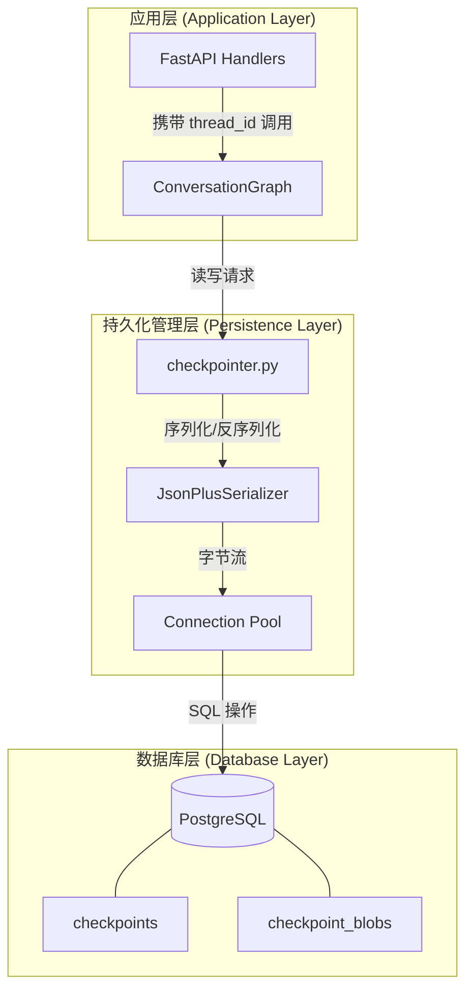
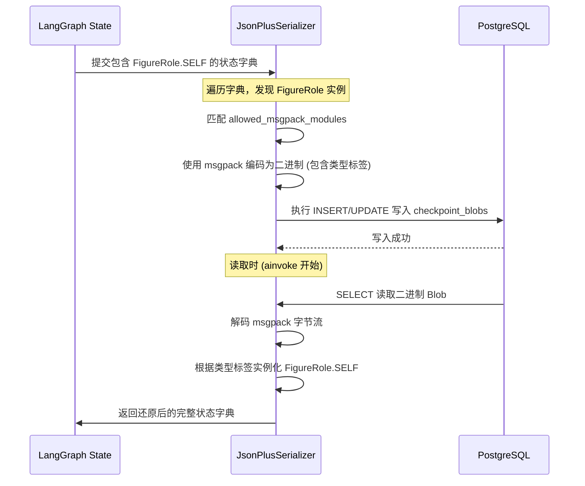
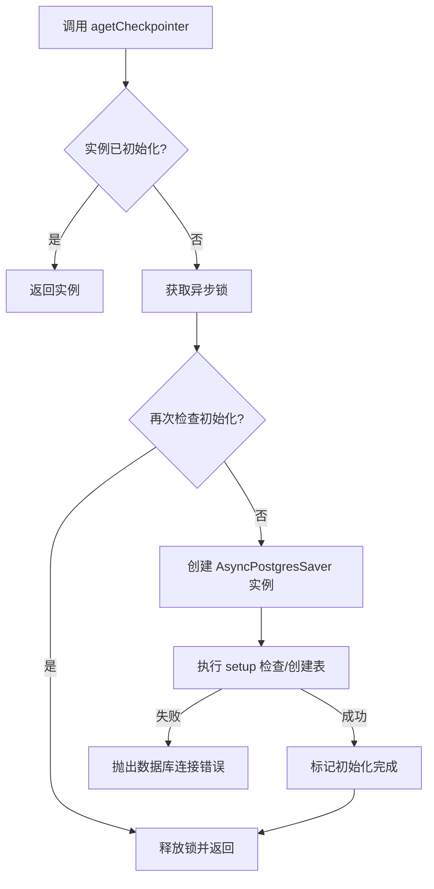
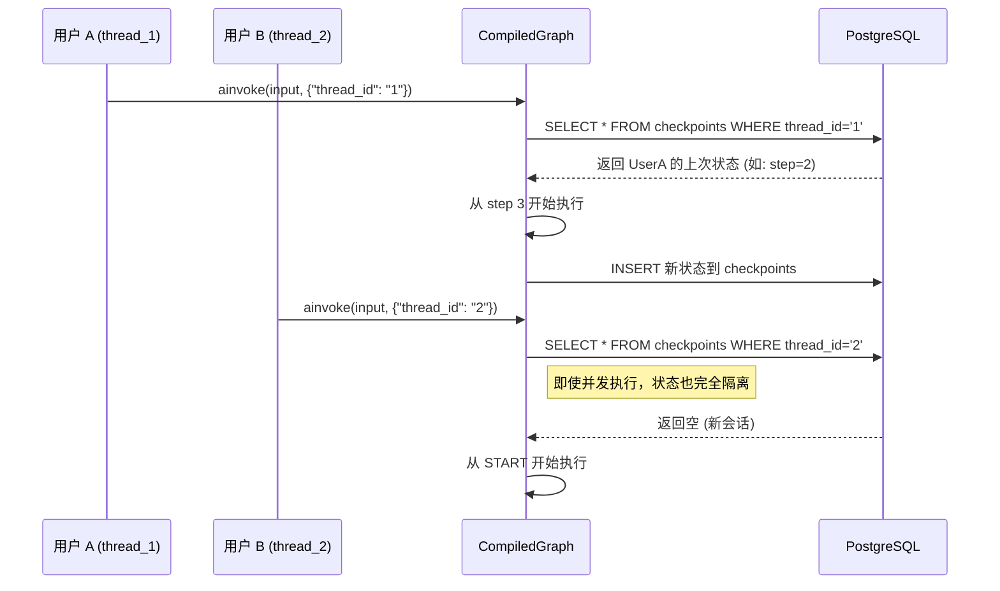

# 图状态管理与持久化

## 目录
1. [引言](#引言)
2. [模块概览](#模块概览)
3. [核心架构与 PostgresSaver 集成](#核心架构与-postgressaver-集成)
4. [自定义序列化与枚举处理](#自定义序列化与枚举处理)
5. [单例模式与数据库自愈](#单例模式与数据库自愈)
6. [在图中绑定持久化层](#在图中绑定持久化层)
7. [状态恢复与异常处理机制](#状态恢复与异常处理机制)
8. [数据库存储结构深度分析](#数据库存储结构深度分析)
9. [关键源码参考](#关键源码参考)

## 引言

在构建复杂的 Agent 系统时，状态管理（State Management）是确保系统健壮性和用户体验的关键。LangGraph 作为一个有状态的图编排框架，其核心优势之一就是能够通过 **Checkpointer** 机制实现图状态的持久化。

在 Immortality 项目中，Agent 不仅仅是一个简单的请求-响应模型，它需要具备“长期记忆”和“任务连续性”。例如，在一个多步骤的数字生命构建流程中，用户可能在完成性格分析后离开，几天后再回来继续价值观的提取。如果没有持久化机制，系统将无法找回之前的进度。

本页面深入探讨了项目中如何利用 `PostgresSaver` 实现 Agent 状态的持久化。通过该机制，系统可以实现以下核心目标：
- **对话连续性**：即使用户在数小时或数天后重新发起对话，Agent 也能从数据库中加载之前的状态，实现无缝对话。
- **容错与恢复**：如果系统在处理复杂的 LLM 链条时崩溃，重启后可以从最后一个成功的 Checkpoint 恢复，避免重复消耗 Token 和计算资源。
- **多会话隔离**：通过 `thread_id` 区分不同的用户会话，确保状态在并发请求下的正确性，防止数据串扰。

## 模块概览

在探索持久化层的实现之前，我们先对涉及的模块和文件规模进行评估。

### 涉及文件统计
- **核心实现文件**：`src/agents/graphs/checkpointer.py`。该文件是整个持久化层的枢纽，定义了如何创建和管理数据库连接。
- **数据模型文件**：`src/database/enums.py`。定义了业务层的所有枚举，这些枚举的序列化方案是持久化的核心难点。
- **应用集成文件**：`src/agents/graphs/ConversationGraph/graph.py`。展示了持久化层如何与业务图逻辑解耦并集成。
- **总文件数**：约 15 个（包含相关联的数据库配置、Alembic 迁移脚本和不同类型的图定义文件）。

### 模块职责划分
- **持久化工厂 (`checkpointer.py`)**：负责 Checkpointer 的实例化、连接管理、单例控制以及自定义序列化器的配置。它屏蔽了底层数据库驱动的复杂性。
- **业务模型 (`enums.py`)**：定义了系统中使用的各种业务枚举（如 `FigureRole`, `Gender`, `MBTI` 等）。这些枚举不仅仅是字符串，还包含了业务逻辑的分类信息。
- **图编排 (`ConversationGraph/`)**：作为持久化层的使用者，它在编译阶段声明对 Checkpointer 的依赖，并在运行阶段通过配置参数触发状态的存取。

## 核心架构与 PostgresSaver 集成

Immortality 项目选择了 PostgreSQL 作为 Checkpointer 的后端存储。相比于内存存储（MemorySaver），PostgreSQL 提供了更好的持久性、可扩展性和查询能力。

### 架构设计
系统同时支持同步和异步的 Checkpointer。在开发初期或简单的脚本任务中，可以使用同步的 `PostgresSaver`；而在 FastAPI 驱动的异步 Web 环境中，则主要使用 `AsyncPostgresSaver`。

下面的架构图展示了 Checkpointer 在系统中的位置及其与其他组件的交互：



该架构将状态管理的复杂性封装在 `checkpointer.py` 中。这种分层设计使得我们可以轻松地更换后端存储（例如从 PostgreSQL 切换到 Redis），而无需修改任何业务图的代码。

### 连接配置与环境依赖
Checkpointer 强烈依赖于环境变量 `CHECKPOINT_DATABASE_URI`。在系统初始化时，如果该变量缺失，系统会立即抛出异常，防止在无持久化的情况下运行。

```python
def _requireCheckpointerURI() -> str:
    uri = (os.getenv("CHECKPOINT_DATABASE_URI") or "").strip()
    if uri == "":
        raise RuntimeError("CHECKPOINT_DATABASE_URI is empty")
    return uri
```

**Section sources**:
- [checkpointer.py:L39-L43](file:///Users/bytedance/Desktop/work/Immortality/src/agents/graphs/checkpointer.py#L39-L43)

## 自定义序列化与枚举处理

在 LangGraph 中，状态通常是一个包含多种数据类型的 Python 字典。由于项目中使用了大量的自定义 Python 枚举类，标准的 JSON 序列化器（只能处理 str, int, float, bool, list, dict）无法满足需求。

### 为什么需要自定义序列化？
如果直接将包含 `FigureRole.SELF` 的对象交给标准 JSON 序列化器，会抛出 `TypeError: Object of type FigureRole is not JSON serializable`。即便使用一些技巧将其转为字符串存储，在读取时它也会保持为字符串，从而破坏了代码中对枚举类型的依赖（例如 `if state.role == FigureRole.SELF` 将失效）。

### JsonPlusSerializer 的配置方案
为了解决这个问题，项目使用了 `JsonPlusSerializer`。这是一个增强型的序列化器，支持通过 `msgpack` 进行高效的二进制序列化，并允许注册自定义模块。

```python
_checkpoint_serde = JsonPlusSerializer(
    allowed_msgpack_modules=[
        FigureRole,
        Gender,
        MBTI,
        FineGrainedFeedDimension,
        FineGrainedFeedConfidence,
        ConflictStatus,
    ]
)
```

通过在 `allowed_msgpack_modules` 中列出这些枚举类，`JsonPlusSerializer` 在序列化时会记录对象的类型信息。在反序列化时，它能自动根据记录的类型信息将数据还原为正确的枚举实例。

### 序列化流程深度解析
当 LangGraph 尝试保存包含枚举的状态时，内部发生的流程如下：



这种配置确保了业务逻辑在处理状态时，拿到的始终是强类型的枚举对象。这对于复杂的条件分支逻辑（如根据 `MBTI` 类型选择不同的回复风格）至关重要。

**Section sources**:
- [checkpointer.py:L27-L36](file:///Users/bytedance/Desktop/work/Immortality/src/agents/graphs/checkpointer.py#L27-L36)
- [enums.py:L5-L117](file:///Users/bytedance/Desktop/work/Immortality/src/database/enums.py#L5-L117)

## 单例模式与数据库自愈

为了避免频繁创建数据库连接池（这会消耗昂贵的数据库连接资源）并确保全局状态的一致性，`checkpointer.py` 采用了严格的单例模式实现。

### agetCheckpointer 的双重检查锁定
异步 Checkpointer 的获取采用了双重检查锁定（Double-Checked Locking）模式。这在高性能的并发场景下尤为重要，因为它能确保即使多个协程同时请求 Checkpointer，也只会触发一次初始化逻辑。

```python
async def agetCheckpointer() -> AsyncPostgresSaver:
    global _async_checkpointer_instance, _async_checkpointer_ctx, _async_checkpointer_setup_done
    # 第一层检查：如果已经初始化完成，直接返回，无需获取锁
    if _async_checkpointer_instance is not None and _async_checkpointer_setup_done:
        return _async_checkpointer_instance
        
    async with _async_checkpointer_lock:
        # 第二层检查：在获取锁之后再次确认，防止在等待锁期间被其他协程初始化
        if _async_checkpointer_instance is not None and _async_checkpointer_setup_done:
            return _async_checkpointer_instance

        if _async_checkpointer_instance is None:
            _async_checkpointer_ctx = AsyncPostgresSaver.from_conn_string(
                _requireCheckpointerURI(),
                serde=_checkpoint_serde,
            )
            # 使用异步上下文管理器进入连接池
            _async_checkpointer_instance = await _async_checkpointer_ctx.__aenter__()

        # 自愈：即使历史实例已创建但表缺失，也会补跑 setup
        await _async_checkpointer_instance.setup()
        _async_checkpointer_setup_done = True

        return _async_checkpointer_instance
```

### 数据库自愈 (Self-healing) 机制
在 `agetCheckpointer` 中调用 `setup()` 方法是一个关键的设计决策。`setup()` 方法由 `langgraph-checkpoint-postgres` 提供，其核心逻辑是：
1. 检查数据库中是否存在名为 `checkpoints`, `checkpoint_blobs`, `checkpoint_writes` 的表。
2. 如果表不存在，则执行预定义的 DDL 语句自动创建这些表。
3. 如果表已存在，则检查表结构是否符合当前版本的需求。

这种“自愈”设计显著降低了运维成本。开发者只需配置好数据库连接，系统在第一次运行时会自动完成所有初始化工作，无需手动执行 SQL 脚本。



**Section sources**:
- [checkpointer.py:L69-L90](file:///Users/bytedance/Desktop/work/Immortality/src/agents/graphs/checkpointer.py#L69-L90)

## 在图中绑定持久化层

在定义好 Checkpointer 后，需要在图编译（Compile）阶段将其绑定到图中。这是 LangGraph 框架的标准用法，但在 Immortality 项目中，我们通过封装函数简化了这一过程。

### ConversationGraph 的集成实现
在 `src/agents/graphs/ConversationGraph/graph.py` 中，`buildConversationGraphWithMemory` 函数负责将异步 Checkpointer 注入到图中。注意，这里特别强调了必须使用异步版本，因为图中的节点（如 LLM 调用）都是异步的。

```python
async def buildConversationGraphWithMemory() -> CompiledStateGraph:
    """
    构建有短期记忆的 ConversationGraph
    【注意】graph 中存在大量异步节点，必须使用异步 checkpointer，必须用 ainvoke 调用图
    """
    # 1. 获取基础图结构定义
    graph = buildBaseConversationGraph()
    
    # 2. 获取（或初始化）全局单例异步 Checkpointer
    checkpointer = await agetCheckpointer()
    
    # 3. 编译图并绑定持久化层
    return graph.compile(checkpointer=checkpointer)
```

### thread_id 与多租户隔离
一旦图绑定了 Checkpointer，它就变成了一个“有记忆”的实体。为了区分不同的记忆片段，每次调用 `ainvoke` 时都必须提供一个 `configurable` 配置项，其中包含 `thread_id`。

```python
# 示例：如何调用带持久化的图
graph = await getConversationGraph()
config = {"configurable": {"thread_id": "user_123_session_456"}}
result = await graph.ainvoke(input_data, config=config)
```

`thread_id` 的作用类似于数据库中的主键或会话 ID。LangGraph 会根据这个 ID 在数据库中检索对应的状态快照。如果 ID 不存在，则从 `START` 节点开始全新的运行；如果 ID 存在，则从上次停止的地方继续。



**Section sources**:
- [graph.py:L56-L63](file:///Users/bytedance/Desktop/work/Immortality/src/agents/graphs/ConversationGraph/graph.py#L56-L63)

## 状态恢复与异常处理机制

持久化不仅仅是为了记忆，更是为了在异常发生时提供恢复能力。

### 状态恢复流程
当一个图运行因为超时、网络抖动或 LLM 限制而失败时，它的状态会被保留在数据库中。开发者可以通过相同的 `thread_id` 再次调用图。LangGraph 会检测到该线程存在未完成的运行，并尝试从最后一个稳定的 Checkpoint 重新开始。

### 常见的持久化异常
1. **SerializationError**：通常是因为在状态中放入了不可序列化的对象（如数据库连接、复杂的类实例等）。解决方法是将其转换为基础类型或在 `JsonPlusSerializer` 中注册。
2. **ConnectionTimeout**：数据库连接池耗尽。解决方法是增加连接池大小或确保 `closeCheckpointer` 在应用关闭时被正确调用。
3. **TableNotFound**：通常发生在首次部署且 `setup()` 未能成功执行时。

> ⚠️ **警告**：
> 永远不要在状态（State）中存储大型二进制文件或复杂的对象实例。状态应该尽可能保持轻量，只存储必要的业务数据、ID 和标志位。

## 数据库存储结构深度分析

了解底层存储结构有助于排查持久化相关的问题。执行 `setup()` 后，PostgreSQL 中会产生以下表：

| 表名 | 核心字段 | 存储逻辑与用途 |
| :--- | :--- | :--- |
| `checkpoints` | `thread_id`, `checkpoint_id`, `parent_id` | 存储状态的层级关系。通过 `parent_id` 可以实现状态的回溯和分支管理。 |
| `checkpoint_blobs` | `checkpoint_id`, `blob` | 核心数据表。`blob` 字段存储了经过 `JsonPlusSerializer` 处理后的二进制状态数据。 |
| `checkpoint_writes` | `thread_id`, `checkpoint_id`, `task_id`, `data` | 记录每个节点执行时的具体输出。这对于调试复杂的并行节点非常有帮助。 |

### 存储优化建议
由于 LangGraph 采用的是快照式存储，随着对话轮数的增加，`checkpoint_blobs` 表的体积会迅速增长。
- **定期清理**：对于已结束的会话，应通过后台任务清理过期的 Checkpoint。
- **索引优化**：确保 `thread_id` 和 `checkpoint_id` 上有合适的索引（`setup()` 默认会创建基本索引）。

## 关键源码参考

本模块的核心逻辑分布在以下文件中，建议开发者在修改持久化逻辑前仔细阅读：

- [checkpointer.py](file:///Users/bytedance/Desktop/work/Immortality/src/agents/graphs/checkpointer.py)：Checkpointer 的核心工厂实现，包含单例和序列化逻辑。
- [enums.py](file:///Users/bytedance/Desktop/work/Immortality/src/database/enums.py)：定义了所有业务枚举，是序列化配置的参考源。
- [graph.py](file:///Users/bytedance/Desktop/work/Immortality/src/agents/graphs/ConversationGraph/graph.py)：展示了持久化层在业务图中的标准绑定方式。
- [index.py](file:///Users/bytedance/Desktop/work/Immortality/src/database/index.py)：基础数据库连接配置，为 Checkpointer 提供了底层的连接池支持。
