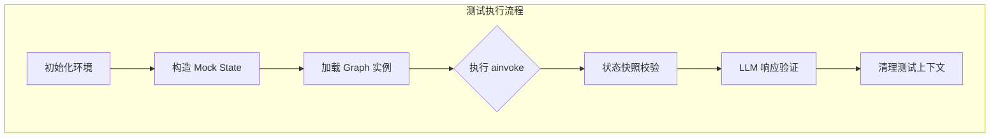
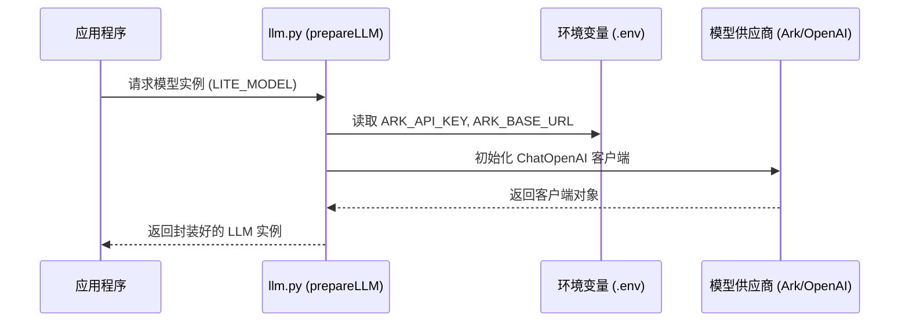
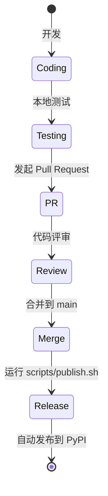

# 开发与贡献指南

## 目录
1. [模块概览](#模块概览)
2. [代码规范](#代码规范)
   - [编码风格与最佳实践](#编码风格与最佳实践)
   - [命名约定与语义化](#命名约定与语义化)
   - [Lint、格式化与静态检查](#lint-格式化与静态检查)
3. [测试框架](#测试框架)
   - [单元测试：CRUD 逻辑验证](#单元测试-crud-逻辑验证)
   - [集成测试：Graph 逻辑与状态流转](#集成测试-graph-逻辑与状态流转)
   - [自动化测试建议](#自动化测试建议)
4. [扩展指南](#扩展指南)
   - [如何添加新的 Tool (工具)](#如何添加新的-tool-工具)
   - [如何集成新的 LLM 模型 (大语言模型)](#如何集成新的-llm-模型-大语言模型)
   - [如何修改或添加 Graph 节点 (图节点)](#如何修改或添加-graph-节点-图节点)
5. [PR 流程与发布](#pr-流程与发布)
   - [分支管理与提交流程](#分支管理与提交流程)
   - [自动化发布流水线](#自动化发布流水线)
6. [文件参考](#文件参考)

## 模块概览

本指南旨在为参与 Immortality 项目开发的贡献者提供全方位的技术指引。Immortality 是一个高度模块化的数字永生系统，其核心逻辑构建在 LangChain 和 LangGraph 之上，旨在通过复杂的图结构工作流实现高度拟人化的交互体验。

作为一个贡献者，理解项目的整体架构和各模块间的协作关系至关重要。本项目包含约 60 个 Python 核心源文件，分布在以下关键子模块中：
- **`src/agents`**: 这是系统的“大脑”。它不仅封装了 LLM 的调用逻辑（`llm.py`, `ark.py`），还定义了复杂的业务工作流图（`graphs/`）。所有的 Agent 行为、决策逻辑和工具调用都在此模块中实现。
- **`src/channels`**: 负责与外部平台的通信。目前主要聚焦于飞书（Lark）的深度集成，包括消息接收、卡片发送、WebSocket 连接管理等。
- **`src/database`**: 提供稳健的数据持久化方案。通过 SQLAlchemy ORM 管理 PostgreSQL 数据库，并利用 Alembic 处理数据库模式的演进（Migrations）。
- **`src/services`**: 业务中台，封装了通用的业务逻辑，如用户信息管理、知识库检索、情感分析反馈等，供 `agents` 模块调用。
- **`tests`**: 质量保障体系。包含了从底层数据库操作到高层图逻辑的全面测试用例。

本指南将深入探讨这些模块的开发规范和扩展路径，帮助您快速上手并贡献高质量的代码。

## 代码规范

在 Immortality 项目中，代码不仅是运行的指令，更是团队沟通的语言。我们追求代码的极致清晰、可维护性和健壮性。

### 编码风格与最佳实践

本项目基于 **Python 3.12+** 开发，充分利用了现代 Python 的特性。

1. **类型提示 (Type Hints)**: 我们强制要求在所有函数和方法中使用类型提示。这不仅能让 IDE 提供更好的补全支持，还能在静态检查阶段发现潜在的类型错误。例如，使用 `Annotated` 来增强参数的语义描述。
2. **异步编程 (Asyncio)**: 考虑到 LLM 调用和网络 IO 的延迟，系统核心链路全面采用异步化设计。开发者应熟练使用 `async/await`，并避免在异步函数中调用阻塞式的同步代码。
3. **日志记录 (Logging)**: 系统使用分级日志管理。`INFO` 级别用于记录关键业务路径，`DEBUG` 用于详尽的开发调试，`ERROR` 则必须包含完整的堆栈信息以便排查。请避免使用 `print` 语句，因为它无法被生产环境的日志系统有效捕获。
4. **防御性编程**: 在处理 LLM 返回的 JSON 字符串或外部 API 响应时，务必进行严格的异常处理和格式校验，防止因输入异常导致整个工作流崩溃。

### 命名约定与语义化

清晰的命名是自文档化代码的核心。

- **类名**: 采用 `PascalCase`（如 `ConversationGraph`, `DatabaseManager`）。
- **函数与变量**: 推荐使用 `camelCase`（如 `getConversationGraph`）以保持与 LangChain 生态的一定一致性，但在纯内部逻辑中也接受 `snake_case`（如 `user_id`）。
- **私有成员**: 习惯上使用单下划线前缀（如 `_internal_method`）表示不应被外部直接访问的成员。
- **布尔变量**: 建议使用 `is_`、`has_` 或 `should_` 前缀（如 `is_finished`, `has_permission`）。

### Lint、格式化与静态检查

虽然项目依赖管理工具 `uv` 已经简化了环境搭建，但我们仍建议在本地集成以下工具以确保代码质量：
- **Ruff**: 一个极其快速的 Python linter 和代码格式化工具，它集成了 Flake8, Isort, Black 等多种工具的功能。
- **Pyright / Mypy**: 用于执行严格的静态类型检查，确保类型提示的正确性。

在提交代码前，运行这些工具可以过滤掉 80% 的低级错误。

**Section sources**:
- [pyproject.toml](file:///Users/bytedance/Desktop/work/Immortality/pyproject.toml)
- [src/agents/types.py](file:///Users/bytedance/Desktop/work/Immortality/src/agents/types.py)

## 测试框架

测试是 Immortality 项目持续集成的核心。我们不接受没有测试覆盖的新功能。

### 单元测试：CRUD 逻辑验证

在 `tests/cruds/` 目录下，我们为每个核心业务实体编写了 CRUD 测试。这些测试通常是同步的，直接与数据库交互，验证 ORM 模型和业务 Service 的正确性。

**测试要点**：
- 确保数据库连接配置正确（通常通过 `.env` 文件）。
- 每个测试用例应保持独立，并在测试结束后清理产生的数据。
- 覆盖边界条件，如查询不存在的用户、插入重复的主键等。

### 集成测试：Graph 逻辑与状态流转

由于系统的核心逻辑是基于 LangGraph 的状态机，因此针对 Graph 的集成测试是重中之重。在 `tests/graphs/` 中，我们模拟了完整的会话生命周期。



在执行 `ConversationGraph.py` 测试时，系统会启动一个真实的 Graph 实例，并注入模拟的用户输入。测试不仅关注最终的文本输出，还会深入检查 `state` 对象中的中间变量（如 `short_term_memory`、`thought_process` 等）是否符合预期流转。

### 自动化测试建议

我们鼓励开发者编写可重复执行的测试脚本。在 `tests/graphs/ConversationGraph.py` 中，您可以看到我们使用了 `pprint` 来美化输出，并记录了整个图执行的耗时。这对于识别性能瓶颈（如某个 Node 执行过慢）非常有帮助。

**Section sources**:
- [tests/graphs/ConversationGraph.py](file:///Users/bytedance/Desktop/work/Immortality/tests/graphs/ConversationGraph.py)
- [tests/cruds/figure_and_relation.py](file:///Users/bytedance/Desktop/work/Immortality/tests/cruds/figure_and_relation.py)

## 扩展指南

Immortality 的架构设计充分考虑了可扩展性，允许开发者在不破坏现有逻辑的前提下添加新功能。

### 如何添加新的 Tool (工具)

Tool 是 Agent 的“手脚”。如果您希望 Agent 具备搜索互联网、查询特定数据库或调用第三方 API 的能力，就需要添加新的 Tool。

**开发路径**：
1. **定义函数**: 在 `src/agents/tools.py` 中编写异步函数。
2. **添加装饰器**: 使用 `@tool` 装饰器，并提供极其详尽的 Docstring。LLM 依赖这段描述来理解何时以及如何使用该工具。
3. **参数处理**: 如果 Tool 的参数需要从全局 State 中提取（而非 LLM 自动填充），请使用 `ToolAndItsArgsHandler` 进行自定义映射。

```python
@tool
async def search_knowledge_base(query: str) -> str:
    """
    当用户询问关于特定背景知识或历史事实时，调用此工具。
    参数 query 是搜索关键词。
    """
    # 这里调用 src.services.knowledge 中的逻辑
    return await knowledge_service.search(query)
```

### 如何集成新的 LLM 模型 (大语言模型)

项目目前深度集成了火山引擎的 Ark 模型，但架构上是兼容 OpenAI 协议的。



如果您想引入一个新的模型提供商（如 Anthropic Claude），您需要在 `src/agents/llm.py` 的 `prepareLLM` 函数中添加相应的配置逻辑。由于我们使用了 LangChain 的 `ChatOpenAI` 抽象，只要对方支持 OpenAI 兼容接口，集成工作将非常简单。

### 如何修改或添加 Graph 节点 (图节点)

Graph 节点是业务逻辑的最小执行单元。修改 Graph 行为通常涉及以下三个文件：

1. **`state.py`**: 定义节点的输入输出数据结构。如果您需要传递新的信息，必须先在这里声明。
2. **`nodes.py`**: 实现节点的具体逻辑。每个节点都是一个接收 `state` 并返回 `Partial[state]` 的异步函数。
3. **`graph.py`**: 负责将节点串联起来。您可以在这里使用 `add_node` 注册节点，并使用 `add_edge` 或 `add_conditional_edges` 定义流转逻辑。

这种“数据驱动”的设计模式确保了逻辑的清晰，使得即使是非常复杂的对话逻辑也能被拆解为易于理解的小块。

**Section sources**:
- [src/agents/tools.py](file:///Users/bytedance/Desktop/work/Immortality/src/agents/tools.py)
- [src/agents/llm.py](file:///Users/bytedance/Desktop/work/Immortality/src/agents/llm.py)
- [src/agents/graphs/ConversationGraph/graph.py](file:///Users/bytedance/Desktop/work/Immortality/src/agents/graphs/ConversationGraph/graph.py)

## PR 流程与发布

我们通过 GitHub 进行协作，并利用自动化脚本简化发布流程。

### 分支管理与提交流程

1. **同步代码**: 开发前请确保本地 `develop` 分支是最新的。
2. **创建分支**: 使用语义化的分支名，如 `feat/add-memory-tool` 或 `fix/lark-callback-timeout`。
3. **提交规范**: 我们推荐使用 [Conventional Commits](https://www.conventionalcommits.org/) 规范编写提交信息。
4. **发起 PR**: 提交 PR 时，请详细描述变更内容、影响范围以及测试结果。

### 自动化发布流水线

项目的发布由 GitHub Actions 驱动。当您向 `main` 分支推送带有 `v*` 格式的 Tag 时，流水线会自动触发，完成构建并发布到 PyPI。



`scripts/publish.sh` 是一个强大的自动化脚本，它会依次执行：版本校验、依赖检查、包构建、Tag 生成以及远程推送。使用该脚本可以避免手动发布时可能出现的版本号不一致或遗漏 Tag 等人为错误。

**Section sources**:
- [docs/CONTRIBUTING.md](file:///Users/bytedance/Desktop/work/Immortality/docs/CONTRIBUTING.md)
- [scripts/publish.sh](file:///Users/bytedance/Desktop/work/Immortality/scripts/publish.sh)

## 文件参考

以下是您在开发过程中最常需要查阅的文件列表：

- **开发指南与规范**:
  - [CONTRIBUTING.md](file:///Users/bytedance/Desktop/work/Immortality/docs/CONTRIBUTING.md): 核心贡献流程说明。
  - [pyproject.toml](file:///Users/bytedance/Desktop/work/Immortality/pyproject.toml): 项目配置与依赖管理。
- **Agent 核心实现**:
  - [src/agents/tools.py](file:///Users/bytedance/Desktop/work/Immortality/src/agents/tools.py): 工具定义与参数处理。
  - [src/agents/llm.py](file:///Users/bytedance/Desktop/work/Immortality/src/agents/llm.py): LLM 初始化与模型适配。
  - [src/agents/graphs/ConversationGraph/graph.py](file:///Users/bytedance/Desktop/work/Immortality/src/agents/graphs/ConversationGraph/graph.py): 核心对话流定义。
- **测试与验证**:
  - [tests/graphs/ConversationGraph.py](file:///Users/bytedance/Desktop/work/Immortality/tests/graphs/ConversationGraph.py): 图逻辑集成测试。
  - [tests/cruds/user.py](file:///Users/bytedance/Desktop/work/Immortality/tests/cruds/user.py): 数据库操作单元测试。
- **自动化工具**:
  - [scripts/publish.sh](file:///Users/bytedance/Desktop/work/Immortality/scripts/publish.sh): 一键发布脚本。
  - [scripts/run-dev.sh](file:///Users/bytedance/Desktop/work/Immortality/scripts/run-dev.sh): 本地开发环境启动脚本。
