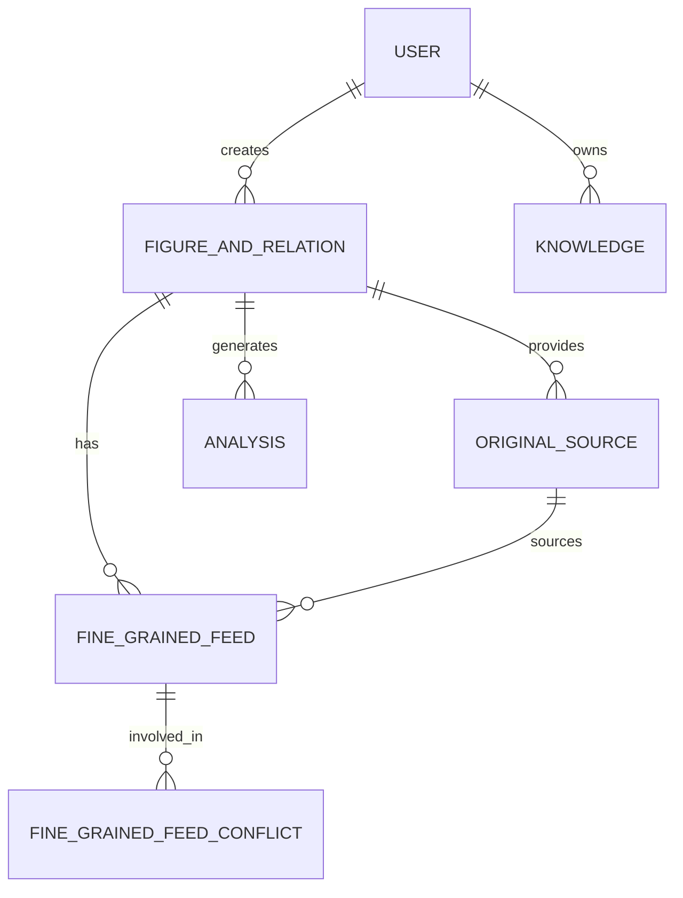
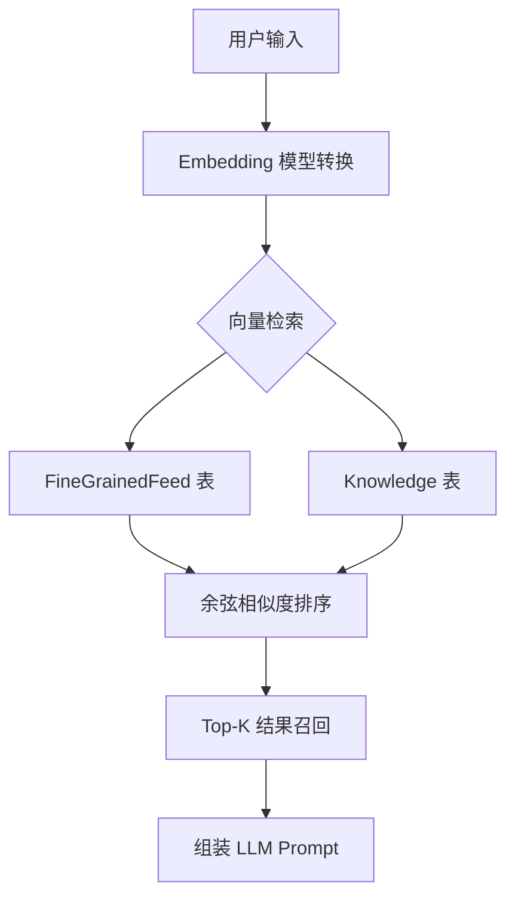
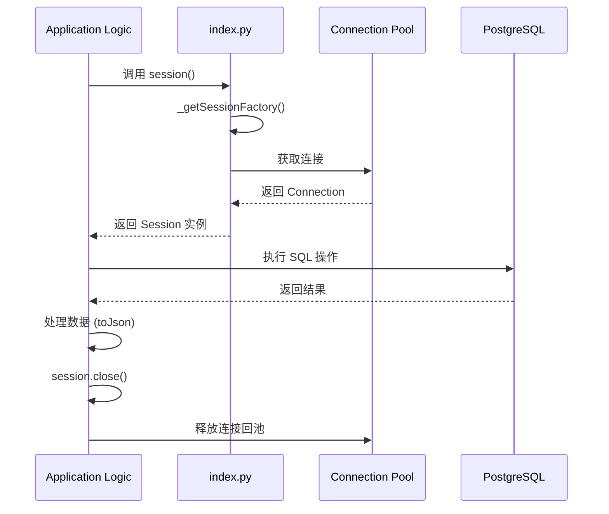
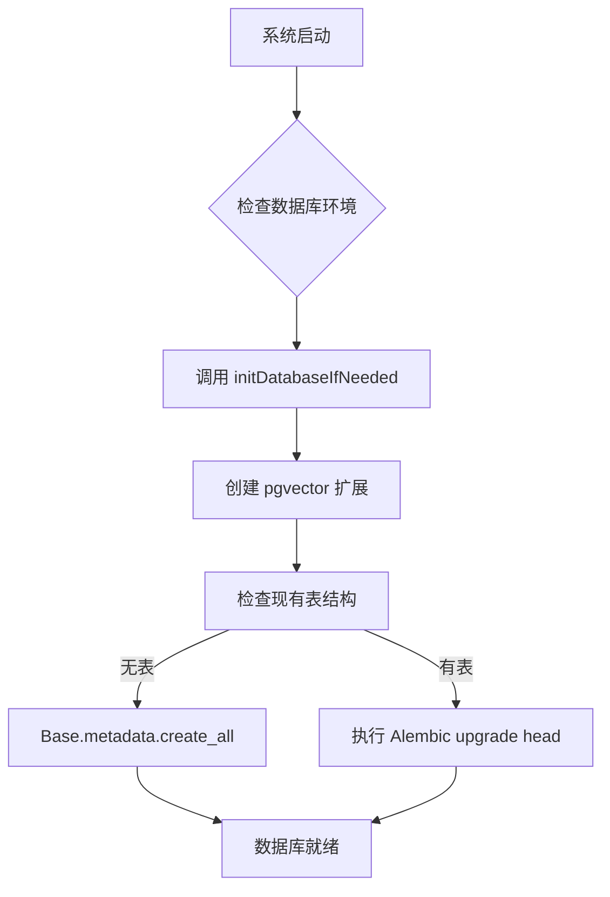

# 数据模型与存储

## 目录
1. [模块概述](#模块概述)
2. [核心数据模型 (Schema)](#核心数据模型-schema)
   - [用户模型 (User)](#用户模型-user)
   - [人物与关系模型 (FigureAndRelation)](#人物与关系模型-figureandrelation)
   - [细粒度信息流 (FineGrainedFeed)](#细粒度信息流-finegrainedfeed)
   - [原始素材与冲突管理](#原始素材与冲突管理)
3. [向量检索实现](#向量检索实现)
   - [pgvector 存储方案](#pgvector-存储方案)
   - [HNSW 索引优化](#hnsw-索引优化)
4. [ORM 与数据库访问](#orm-与数据库访问)
   - [SQLAlchemy 配置与连接池](#sqlalchemy-配置与连接池)
   - [Session 管理与序列化](#session-管理与序列化)
5. [数据迁移与初始化](#数据迁移与初始化)
   - [Alembic 版本控制](#alembic-版本控制)
   - [自动初始化机制](#自动初始化机制)
6. [文件引用](#文件引用)

## 模块概述

`database` 模块是 Digital Immortality 项目的持久化层，负责存储用户信息、虚拟人物（Figure）画像、细粒度记忆片段、原始素材以及分析记录。该模块不仅提供了传统的关系型数据存储，还集成了 `pgvector` 扩展，实现了基于向量相似度的语义检索，为 LLM 的 RAG（检索增强生成）流程提供底层支持。

**模块规模统计：**
- **总文件数**：5 个 Python 核心文件
- **核心表数量**：8 张主要业务表
- **子模块**：包含 `alembic` 数据迁移子模块

**覆盖范围：**
本章节将深入探讨 `models.py` 中的表结构设计、`index.py` 中的连接池管理、向量索引的配置以及 Alembic 的迁移流程。

## 核心数据模型 (Schema)

Digital Immortality 的数据模型设计以“人物画像”为核心，通过多层级的数据结构（从原始素材到提炼后的细粒度信息）来构建数字生命的记忆系统。

### 用户模型 (User)

`User` 表存储系统的基本用户信息，包括认证凭据和等级权限。

```python
class User(Base, SerializableMixin):
    id = Column(Integer, primary_key=True, autoincrement=True)
    username = Column(String(64), unique=True, nullable=False, index=True)
    password = Column(Text, nullable=False)
    nickname = Column(String(64), nullable=True, index=True)
    gender = Column(Enum(Gender), nullable=False)
    level = Column(Enum(UserLevel), default=UserLevel.L4)
    lark_open_id = Column(Text, nullable=True, unique=True)
    created_at = Column(DateTime, default=datetime.now(timezone.utc))
```

### 人物与关系模型 (FigureAndRelation)

这是系统的核心表，存储了虚拟人物的基础属性（MBTI、职业、喜好等）以及经过 LLM 提炼后的核心性格、互动风格和人生记忆。

**关键字段说明：**
- `core_personality`: 核心性格与价值观，决定了 Figure 的底层逻辑。
- `core_interaction_style`: 核心互动风格，决定了 Figure 如何与用户对话。
- `words_figure2user`: 存储真实的对话样本，用于少样本学习（Few-shot prompting）。

### 细粒度信息流 (FineGrainedFeed)

为了支持长短期记忆，系统将复杂的人物信息拆解为细粒度的 `Feed` 片段。每个片段都包含向量表示（Embedding），支持语义检索。

The following diagram illustrates the core Entity-Relationship (ER) structure of the database.



该模型采用了典型的星型结构，以 `FigureAndRelation` 为中心，连接了素材层（OriginalSource）、提炼层（FineGrainedFeed）和应用层（Analysis）。这种设计保证了数据流向的清晰：原始数据流入 -> LLM 提炼 -> 细粒度存储 -> 向量检索应用。

**Section sources**:
- [models.py](file:///Users/bytedance/Desktop/work/Immortality/src/database/models.py)
- [enums.py](file:///Users/bytedance/Desktop/work/Immortality/src/database/enums.py)

---

## 向量检索实现

向量检索是实现“数字永生”的关键技术，它允许系统从海量的记忆片段中快速找到与当前对话上下文最相关的部分。

### pgvector 存储方案

系统使用 `pgvector` 扩展在 PostgreSQL 中直接存储向量。在 `FineGrainedFeed` 和 `Knowledge` 表中，`embedding` 字段被定义为 `Vector(1024)` 类型。

```python
from pgvector.sqlalchemy import Vector

class FineGrainedFeed(Base, SerializableMixin):
    # ...
    embedding = Column(
        Vector(1024), nullable=False, comment="向量表示"
    )
```

> **Note**: 向量维度固定为 1024，这与项目使用的 Embedding 模型（如 OpenAI 或国产大模型）的输出维度保持一致。

### HNSW 索引优化

为了在海量数据下保持高性能检索，系统配置了 HNSW（Hierarchical Navigable Small World）索引。相比于传统的 IVFFlat，HNSW 在高维向量检索中具有更高的召回率和更快的响应速度。

```python
__table_args__ = (
    Index(
        "ix_fine_grained_feed_embedding_hnsw",
        "embedding",
        postgresql_using="hnsw",
        postgresql_ops={"embedding": "vector_cosine_ops"},
    ),
)
```

The following flowchart describes the process of vector indexing and retrieval during a RAG cycle.



检索流程始于用户输入的向量化，随后在数据库层利用 HNSW 索引执行余弦相似度（`vector_cosine_ops`）计算。通过在 SQL 层面完成 Top-K 过滤，极大地减轻了应用层的计算负担，并保证了 RAG 流程的低延迟。

**Section sources**:
- [models.py:L249-L258](file:///Users/bytedance/Desktop/work/Immortality/src/database/models.py#L249-L258)
- [models.py:L303-L311](file:///Users/bytedance/Desktop/work/Immortality/src/database/models.py#L303-L311)

---

## ORM 与数据库访问

项目采用 SQLAlchemy 作为 ORM 框架，通过封装底层的连接池和 Session 管理，提供了简洁的数据库操作接口。

### SQLAlchemy 配置与连接池

在 `index.py` 中，系统通过环境变量动态配置数据库连接池。

```python
def _buildEngine():
    return create_engine(
        url=os.getenv("DATABASE_URI") or "",
        echo=False,
        pool_size=int(os.getenv("DB_POOL_SIZE", "5")),
        max_overflow=int(os.getenv("DB_MAX_OVERFLOW", "10")),
        pool_timeout=int(os.getenv("DB_POOL_TIMEOUT", "60")),
        pool_recycle=int(os.getenv("DB_POOL_RECYCLE", "3600")),
        pool_pre_ping=True,
    )
```

**关键配置参数：**
- `pool_size`: 基础连接池大小，默认为 5。
- `max_overflow`: 允许溢出的最大连接数，应对突发流量。
- `pool_pre_ping`: 在从池中取出连接前进行心跳检测，防止因数据库重启导致的“断连”异常。

### Session 管理与序列化

系统通过 `session()` 函数提供线程/进程安全的 Session 实例。同时，为了方便 API 返回 JSON 数据，所有模型都继承了 `SerializableMixin`。

```python
def session():
    return _getSessionFactory()()
```

`SerializableMixin` 能够自动处理 `datetime` 对象的 ISO 格式化、`Enum` 对象的取值以及关联模型的递归序列化，极大地简化了 Controller 层的代码。

The sequence diagram below shows how a database session is managed within a typical request lifecycle.



Session 的生命周期管理采用了“按需获取，及时释放”的原则。通过 `_getSessionFactory` 中的 PID 检查，系统确保了在多进程环境（如 Gunicorn）下，每个进程都拥有独立的连接池，避免了跨进程共享连接导致的竞争和死锁问题。

**Section sources**:
- [index.py](file:///Users/bytedance/Desktop/work/Immortality/src/database/index.py)
- [models.py:L46-L92](file:///Users/bytedance/Desktop/work/Immortality/src/database/models.py#L46-L92)

---

## 数据迁移与初始化

随着业务逻辑的演进，数据库 Schema 也会频繁变动。系统集成了 Alembic 来管理这些变更。

### Alembic 版本控制

Alembic 的 `env.py` 被配置为自动读取 `models.py` 中的 `Base.metadata`，从而支持 `autogenerate` 功能。

```python
# alembic/env.py
from src.database.models import Base
target_metadata = Base.metadata
```

开发者只需运行 `alembic revision --autogenerate` 即可自动生成迁移脚本，确保了开发、测试和生产环境的数据库结构一致性。

### 自动初始化机制

为了简化部署流程，`models.py` 提供了一个 `initDatabaseIfNeeded` 函数。该函数在系统启动时会自动检查并创建 `vector` 扩展及所有缺失的表。

```python
def initDatabaseIfNeeded():
    engine = _buildEngine()
    try:
        with engine.begin() as conn:
            conn.exec_driver_sql("CREATE EXTENSION IF NOT EXISTS vector;")
        # ... 检查表是否存在并创建
        Base.metadata.create_all(bind=engine)
    finally:
        engine.dispose()
```

The following flowchart shows the database initialization and migration check sequence during system startup.



初始化流程首先确保 PostgreSQL 环境支持向量运算（`CREATE EXTENSION`），随后通过 SQLAlchemy 的 `inspect` 工具判断是否为首次安装。这种“自愈”式的初始化机制降低了运维复杂度，使得项目在不同环境下的迁移变得异常简单。

**Section sources**:
- [alembic/env.py](file:///Users/bytedance/Desktop/work/Immortality/src/database/alembic/env.py)
- [models.py:L653-L675](file:///Users/bytedance/Desktop/work/Immortality/src/database/models.py#L653-L675)

---

## 文件引用

以下是本章节涉及的核心源代码文件：

- [src/database/models.py](file:///Users/bytedance/Desktop/work/Immortality/src/database/models.py): 定义了所有的数据库模型、序列化逻辑及初始化工具。
- [src/database/enums.py](file:///Users/bytedance/Desktop/work/Immortality/src/database/enums.py): 存储了所有数据库相关的枚举类型（如 MBTI、FigureRole 等）。
- [src/database/index.py](file:///Users/bytedance/Desktop/work/Immortality/src/database/index.py): 负责 SQLAlchemy 引擎构建、连接池配置及 Session 工厂管理。
- [src/database/alembic/env.py](file:///Users/bytedance/Desktop/work/Immortality/src/database/alembic/env.py): Alembic 迁移环境配置，连接了 ORM 模型与迁移引擎。
- [src/database/README.md](file:///Users/bytedance/Desktop/work/Immortality/src/database/README.md): 数据库模块的简要说明文档。
