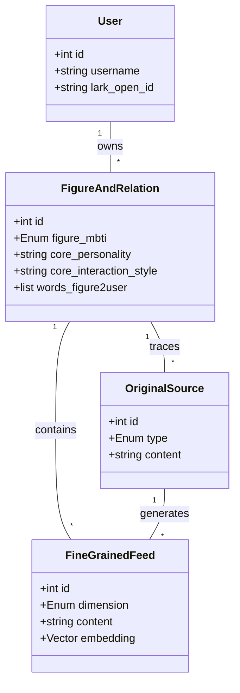
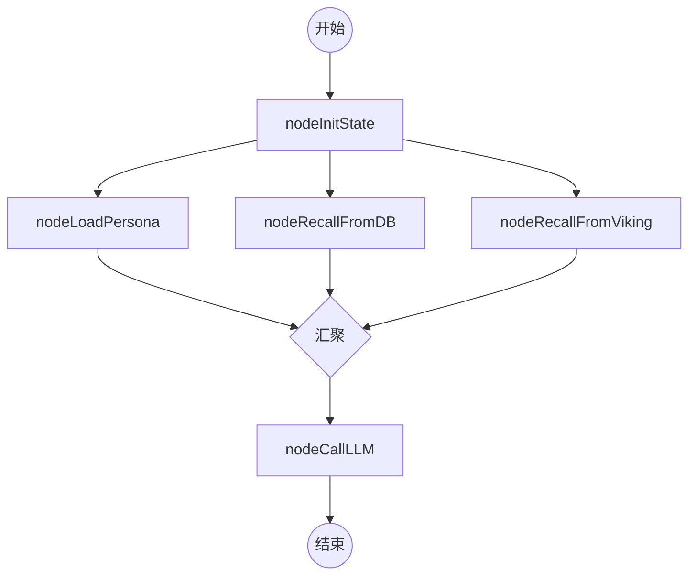
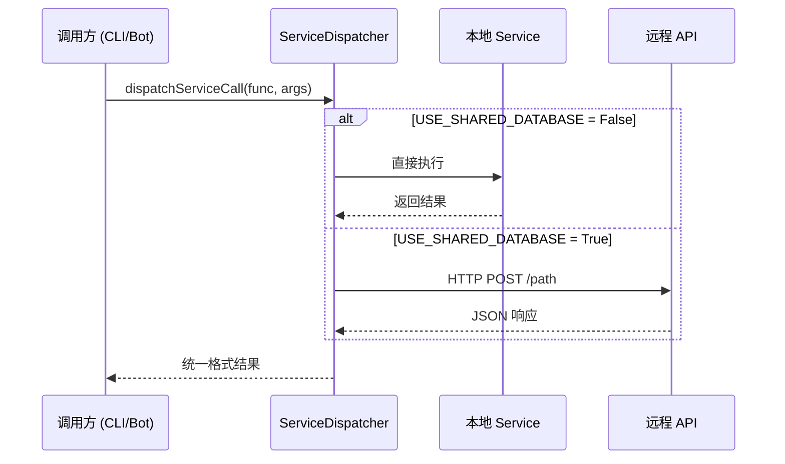
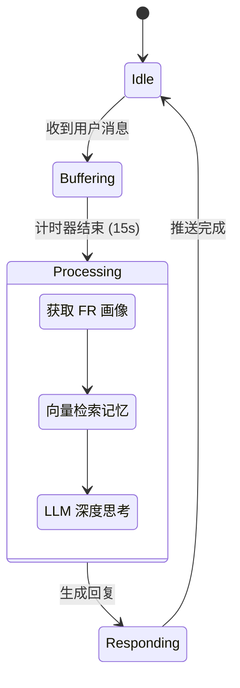

# 核心概念与架构

## 目录
1. [模块概览](#模块概览)
2. [引言](#引言)
3. [Figure and Relation (FR) 模型](#figure-and-relation-fr-模型)
   - [核心实体与关系](#核心实体与关系)
   - [人格演进机制](#人格演进机制)
4. [长短期记忆机制](#长短期记忆机制)
   - [短期记忆 (STM)：有状态会话](#短期记忆-stm有状态会话)
   - [长期记忆 (LTM)：混合检索架构](#长期记忆-ltm混合检索架构)
5. [有状态代理 (Stateful Agents)](#有状态代理-stateful-agents)
   - [图驱动的工作流](#图驱动的工作流)
   - [状态管理策略](#状态管理策略)
6. [服务调度器 (Service Dispatcher)](#服务调度器-service-dispatcher)
   - [中枢协调逻辑](#中枢协调逻辑)
7. [数据流转与状态迁移](#数据流转与状态迁移)
8. [核心组件](#核心组件)
9. [文件引用](#文件引用)

## 模块概览

在对 Digital Immortality 项目进行系统性扫描后，本章节将深入探讨其核心架构设计。

**项目规模评估**：
- **总文件数**：共发现 53 个 Python 源代码文件。
- **核心子模块**：
    - `src/agents/`：包含 LangGraph 驱动的智能体逻辑、图定义及状态管理（重点覆盖）。
    - `src/database/`：定义了 FR 模型及向量数据库 Schema（重点覆盖）。
    - `src/services/`：实现业务逻辑层。
    - `src/channels/`：处理外部接入渠道（如飞书）。
    - `src/service_dispatcher.py`：作为系统调度的中枢（重点覆盖）。

本章节将深度解析这些模块如何协同工作，实现从“数据采集”到“人格模拟”的闭环。

## 引言

Digital Immortality（数字永生）的设计哲学在于将人类的复杂人格、记忆与互动风格，通过结构化的数据模型（FR 模型）进行抽象与重构。系统不仅是一个简单的对话机器人，而是一个能够通过持续输入（聊天记录、自然语言叙述）实现自我演进的数字生命体。

其核心目标是解决 AI 在长程对话中的“幻觉”与“遗忘”问题，通过结合图计算（LangGraph）的确定性流程与向量检索（RAG）的灵活性，构建一个具有深度上下文感知能力的系统。

## Figure and Relation (FR) 模型

FR 模型是 Digital Immortality 的灵魂。它将人格拆解为“人物（Figure）”和“关系（Relation）”两个维度，通过细粒度的信息流（Feeds）驱动人格的持续丰富。

### 核心实体与关系

在 `src/database/models.py` 中，FR 模型通过 SQLAlchemy 进行定义。

- **FigureAndRelation (FR)**：核心容器，存储人物的基本画像（MBTI、喜好、语言风格）以及与用户的关系描述。
- **FineGrainedFeed**：细粒度信息条目，包含性格、互动风格、程序性知识和人生记忆。
- **OriginalSource**：原始素材，记录信息的来源（如截图、叙述），确保数据的可回溯性。

下面的类图展示了这些实体之间的组合与引用关系：



**图表说明**：
该图展示了以 `User` 为核心的层级结构。一个用户可以拥有多个 `FigureAndRelation`（即多个数字人格），每个 FR 包含大量的 `FineGrainedFeed`。特别地，`FineGrainedFeed` 必须溯源至 `OriginalSource`，这保证了 AI 提取的信息具有事实依据，方便进行冲突检测与修正。

### 人格演进机制

人格的演进是一个异步的、增量的过程。当新素材进入系统时，`ContextGraph` 会被触发，重新计算并更新 `FigureAndRelation` 中的 `core_*` 字段。

**演进流程**：
1. **素材采集**：用户上传截图或发送叙述。
2. **知识抽取**：通过 LLM 识别出性格点、事件或互动习惯。
3. **冲突检测**：检查新信息是否与旧有 `FineGrainedFeed` 矛盾（由 `FineGrainedFeedConflict` 处理）。
4. **画像重构**：更新 FR 表中的汇总描述字段。

**Section sources**:
- [src/database/models.py](file:///Users/bytedance/Desktop/work/Immortality/src/database/models.py)
- [src/database/enums.py](file:///Users/bytedance/Desktop/work/Immortality/src/database/enums.py)

## 长短期记忆机制

系统通过一套混合存储架构，实现了跨会话的记忆保持。

### 短期记忆 (STM)：有状态会话

短期记忆主要由 LangGraph 的 `Checkpoint` 机制承担。通过 `PostgresSaver`，系统能够将每一个节点执行后的 `State` 快照持久化到数据库中。

- **作用**：记录当前对话的上下文、中间推理过程（Reasoning Content）以及 LLM 的历史消息。
- **实现**：在调用 `graph.ainvoke` 时传入 `thread_id`，系统会自动加载并更新对应的状态。

### 长期记忆 (LTM)：混合检索架构

长期记忆由 PostgreSQL 结构化数据与 `pgvector` 向量检索共同组成。

- **向量召回**：使用 `doubao-embedding` 模型将文本向量化，存储在 `FineGrainedFeed.embedding` 中。
- **混合评分算法**：
  召回不仅仅依靠余弦相似度，还引入了**权重 (Weight)** 和 **时间衰减 (Time Decay)**。

```mermaid
flowchart LR
    Query[用户输入/查询] --> Emb[向量化]
    Emb --> Search[向量检索]
    Search --> Candidates[候选列表]
    
    subgraph Scoring[多维评分]
        direction TB
        S1[语义相似度 1-dist]
        S2[业务权重 Weight]
        S3[时间衰减 exp(-dt/HL)]
    end
    
    Candidates --> Scoring
    Scoring --> Final[Top-K 记忆块]
```

**图表说明**：
此流程图描述了 LTM 的召回逻辑。系统通过语义相似度（占比 80%）和业务权重（占比 20%）计算基础分，再乘以基于创建时间的指数衰减系数。这种设计确保了系统既能记住重要且相关的历史，又能优先关注近期的变动，模拟人类“近因效应”的记忆特征。

**Section sources**:
- [src/agents/graphs/checkpointer.py](file:///Users/bytedance/Desktop/work/Immortality/src/agents/graphs/checkpointer.py)
- [src/agents/viking.py](file:///Users/bytedance/Desktop/work/Immortality/src/agents/viking.py)

## 有状态代理 (Stateful Agents)

Digital Immortality 摒弃了简单的 ReAct 模式，转而采用基于 LangGraph 的有状态工作流。

### 图驱动的工作流

系统定义了多个特化图（Specialized Graphs），每个图负责特定的任务：

1. **ContextGraph**：上下文构建图。负责从 DB 和向量库中检索信息，组织成 LLM 可理解的 `context_block`。
2. **VirtualFigureGraph**：虚拟人格图。核心对话逻辑，负责模拟对方语气进行回复。
3. **AnalysisGraph**：分析图。对聊天记录进行深度解析，提供回复建议。

### 状态管理策略

每个图都有明确的 `State` 定义（通常继承自 `TypedDict` 或 `MessagesState`）。

```python
class VirtualFigureGraphState(MessagesState):
    request: Request
    context_block: str  # 关系与画像上下文
    words_to_user: str  # 对方典型语气
    recalled_facts_from_db: str  # 数据库召回的事实
    llm_output: LLMOutput
```

这种显式的状态定义使得复杂的并行节点执行变得可预测。例如，在 `VirtualFigureGraph` 中，画像加载、DB 召回和 Viking 记忆检索是并行执行的，最后在 `nodeCallLLM` 节点进行汇聚。



**图表说明**：
该状态机展示了 `VirtualFigureGraph` 的并行处理能力。通过将耗时的 IO 操作（加载画像、检索数据库、调用远端记忆库）放在并行节点中，系统显著降低了端到端延迟。只有当所有前置上下文准备就绪后，才会触发 LLM 调用。

**Section sources**:
- [src/agents/graphs/ConversationGraph/graph.py](file:///Users/bytedance/Desktop/work/Immortality/src/agents/graphs/ConversationGraph/graph.py)
- [src/agents/types.py](file:///Users/bytedance/Desktop/work/Immortality/src/agents/types.py)

## 服务调度器 (Service Dispatcher)

`src/service_dispatcher.py` 是系统的通讯总线，它屏蔽了底层部署环境的差异。

### 中枢协调逻辑

`dispatchServiceCall` 函数根据环境变量 `USE_SHARED_DATABASE` 决定调用路径：
- **本地模式**：直接调用 `src/services/` 下的函数，操作本地数据库。
- **远程模式**：通过 HTTP 协议将请求转发至中心化的 API 服务。

这种设计使得 CLI 工具、Web 后端和异步 Worker 可以无缝切换运行模式。



**图表说明**：
此序列图展示了服务调度的透明性。调用方无需关心服务是在本地进程运行还是在远程服务器上。Dispatcher 负责处理鉴权（注入 Access Token）、序列化以及同步/异步转换，极大地简化了多端开发的复杂度。

**Section sources**:
- [src/service_dispatcher.py](file:///Users/bytedance/Desktop/work/Immortality/src/service_dispatcher.py)
- [src/utils/request.py](file:///Users/bytedance/Desktop/work/Immortality/src/utils/request.py)

## 数据流转与状态迁移

一个典型的“虚拟人对话”请求在系统内部的流转路径如下：

1. **输入阶段**：飞书 Bot 接收消息，通过 `messageHandler` 缓冲并打包。
2. **上下文构建**：调用 `ContextGraph`。
   - 节点 `nodeGenBasicContext` 从 `RelationChain` 获取基础画像。
   - 节点 `nodeRecallFromDB` 基于当前消息进行向量召回。
3. **推理与生成**：调用 `VirtualFigureGraph`。
   - 加载 `context_block`。
   - 调用 Ark SDK 获取支持 `reasoning_content` 的深度思考模型响应。
4. **输出阶段**：解析 `LLMOutput`，通过 WebSocket 推送至客户端。



**图表说明**：
该状态图描述了系统应对高频互动的策略。为了模拟真实的人类回复习惯，系统引入了 15 秒的缓冲机制（Buffering），避免对用户的每一句话都立即响应。在 Processing 阶段，系统经历了完整的上下文检索与推理过程。最后，生成的回复会以随机间隔分条推送（Responding），增强了“拟人化”体验。

## 核心组件

| 组件名称 | 定义文件 | 主要职责 |
| :--- | :--- | :--- |
| `FigureAndRelation` | `models.py` | 定义人格与关系的数据结构，支持 JSON 序列化。 |
| `ContextGraph` | `graph.py` | 负责多源上下文的检索、清洗与结构化组织。 |
| `PostgresSaver` | `checkpointer.py` | 实现基于 PostgreSQL 的 LangGraph 状态持久化。 |
| `dispatchServiceCall` | `service_dispatcher.py` | 统一的服务分发入口，支持本地/远程模式切换。 |
| `arkAinvoke` | `ark.py` | 封装火山方舟 SDK，支持深度思考字段的提取。 |

## 文件引用

本章节内容基于对以下核心文件的深度分析：

- [src/database/models.py](file:///Users/bytedance/Desktop/work/Immortality/src/database/models.py)：核心数据模型。
- [src/service_dispatcher.py](file:///Users/bytedance/Desktop/work/Immortality/src/service_dispatcher.py)：系统调度中枢。
- [src/agents/types.py](file:///Users/bytedance/Desktop/work/Immortality/src/agents/types.py)：Agent 状态与类型定义。
- [src/agents/graphs/ConversationGraph/graph.py](file:///Users/bytedance/Desktop/work/Immortality/src/agents/graphs/ConversationGraph/graph.py)：对话图实现。
- [src/agents/ark.py](file:///Users/bytedance/Desktop/work/Immortality/src/agents/ark.py)：大模型调用封装。
- [src/agents/embedding.py](file:///Users/bytedance/Desktop/work/Immortality/src/agents/embedding.py)：向量化逻辑。
- [src/agents/graphs/checkpointer.py](file:///Users/bytedance/Desktop/work/Immortality/src/agents/graphs/checkpointer.py)：状态持久化实现。
- [docs/HEARTCOMPASS.md](file:///Users/bytedance/Desktop/work/Immortality/docs/HEARTCOMPASS.md)：研发设计文档。
