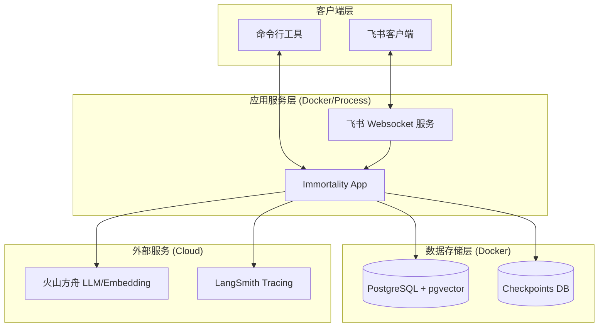
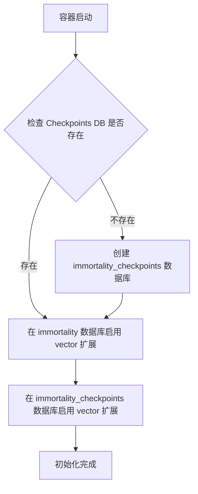
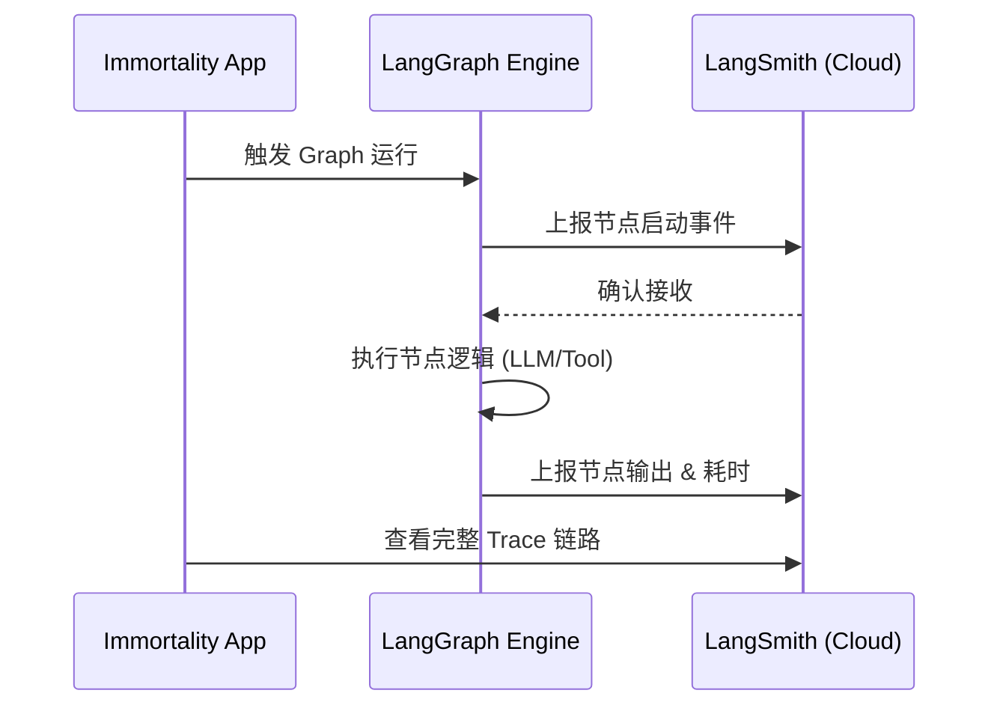
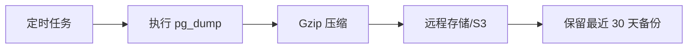

# 部署与运维

## 目录
1. [模块概览](#模块概览)
2. [引言](#引言)
3. [系统架构与部署拓扑](#系统架构与部署拓扑)
4. [容器化部署指南](#容器化部署指南)
   - [Docker Compose 配置解析](#docker-compose-配置解析)
   - [数据库初始化流程](#数据库初始化流程)
5. [环境变量管理](#环境变量管理)
   - [核心配置项详解](#核心配置项详解)
   - [安全配置建议](#安全配置建议)
6. [数据库运维与迁移](#数据库运维与迁移)
   - [自动化迁移机制](#自动化迁移机制)
   - [手动干预与故障排除](#手动干预与故障排除)
7. [监控与日志系统](#监控与日志系统)
   - [应用日志架构](#应用日志架构)
   - [LangSmith 工作流追踪](#langsmith-工作流追踪)
8. [备份与恢复策略](#备份与恢复策略)
   - [全量备份流程](#全量备份流程)
   - [数据恢复验证](#数据恢复验证)
9. [关键文件参考](#关键文件参考)

## 模块概览

在本模块的探索过程中，我们深入分析了 Immortality 项目的生产环境部署与运维体系。该体系主要围绕着容器化基础设施、动态环境变量配置、自动化数据库管理以及全方位的工作流监控展开。

**探索范围与深度：**
- **文件总数**：共涉及约 10 个核心部署与脚本文件。
- **覆盖子目录**：重点覆盖了 `src/cli/assets/`（基础设施配置）和 `scripts/`（运维脚本）。
- **核心组件**：详细分析了 `docker-compose.yml`、`.env.example`、`db-migrate.sh` 和 `run-langsmith.sh` 等关键文件。
- **深度说明**：本章节将从基础设施层、应用配置层、数据持久化层和运维监控层四个维度，全面阐述系统在生产环境下的稳定运行保障机制。

## 引言

Immortality（数字永生）系统作为一个复杂的 AI 驱动应用，其稳定性和可维护性直接决定了用户体验的连续性。在生产环境中，部署与运维不仅仅是“让程序跑起来”，更涉及到如何高效地管理资源、如何确保数据的安全性与一致性、以及如何在出现异常时快速定位和恢复。

本章节旨在为系统管理员和开发者提供一套标准化的生产环境部署方案。通过引入 Docker 容器化技术，我们实现了基础设施的代码化（Infrastructure as Code），确保了开发、测试与生产环境的高度一致。同时，通过精细化的环境变量管理和多维度的监控追踪，系统能够灵活应对各种复杂的运行需求，并为后续的性能优化提供数据支持。

## 系统架构与部署拓扑

在生产环境下，Immortality 采用典型的“应用-数据库”解耦架构。应用服务通过 CLI 或 Websocket 方式运行，而持久化层则由具备向量检索能力的 PostgreSQL 支撑。

以下是系统的部署架构图，展示了各组件之间的交互关系：



**架构说明**：
- **应用服务层**：支持通过 `immortality lark-service start` 启动飞书服务，或通过 CLI 直接交互。
- **数据存储层**：利用 `pgvector` 扩展实现高性能的向量存储与检索，支持业务数据与 LangGraph Checkpoints 的分离存储。
- **外部服务**：深度集成火山方舟（Ark）提供的模型能力，并通过 LangSmith 进行异步的工作流追踪与性能分析。

**Diagram sources**:
- [src/main.py](file:///Users/bytedance/Desktop/work/Immortality/src/main.py)
- [src/cli/assets/docker-compose.yml](file:///Users/bytedance/Desktop/work/Immortality/src/cli/assets/docker-compose.yml)

## 容器化部署指南

容器化是确保 Immortality 快速部署和水平扩展的基础。目前，项目提供了针对 PostgreSQL 数据库的 Docker Compose 配置，而应用层则建议根据具体环境灵活选择容器化或直接进程运行。

### Docker Compose 配置解析

`docker-compose.yml` 定义了核心数据库服务，采用了 `pgvector/pgvector:pg16` 镜像，这是实现 AI 记忆检索的关键。

```yaml
services:
  postgres:
    image: pgvector/pgvector:pg16
    container_name: immortality-postgres
    restart: unless-stopped
    environment:
      POSTGRES_USER: immortality
      POSTGRES_PASSWORD: immortality_password
      POSTGRES_DB: immortality
    ports:
      - "5432:5432"
    volumes:
      - immortality_postgres_data:/var/lib/postgresql/data
      - ./init-db.sh:/docker-entrypoint-initdb.d/init-db.sh:ro
```

**配置要点**：
- **持久化**：使用具名卷 `immortality_postgres_data` 确保容器重启或销毁后数据不丢失。
- **初始化脚本**：通过挂载 `init-db.sh` 到 `/docker-entrypoint-initdb.d/`，在数据库首次启动时自动执行必要的初始化逻辑。

### 数据库初始化流程

在容器启动过程中，`init-db.sh` 扮演了至关重要的角色。它不仅负责创建备用的 Checkpoints 数据库，还负责在所有相关数据库中启用 `vector` 扩展。



**初始化逻辑说明**：
1. **幂等性检查**：脚本会先查询 `pg_database` 系统表，确认 `immortality_checkpoints` 是否已存在，避免重复创建导致的错误。
2. **扩展加载**：`CREATE EXTENSION IF NOT EXISTS vector;` 确保了向量检索能力的可用性。这是系统实现“长期记忆”的技术基石。

**Section sources**:
- [src/cli/assets/docker-compose.yml](file:///Users/bytedance/Desktop/work/Immortality/src/cli/assets/docker-compose.yml)
- [src/cli/assets/init-db.sh](file:///Users/bytedance/Desktop/work/Immortality/src/cli/assets/init-db.sh)

## 环境变量管理

环境变量是 Immortality 系统的“神经中枢”，控制着从数据库连接到 AI 模型调用的方方面面。

### 核心配置项详解

项目在 `src/cli/assets/.env.example` 中提供了详尽的模板。以下是生产环境下必须重点配置的几类变量：

| 类别 | 变量名 | 说明 | 安全建议 |
| :--- | :--- | :--- | :--- |
| **数据库** | `DATABASE_URI` | 主数据库连接串 | 生产环境严禁使用默认密码，建议使用专用用户 |
| **鉴权** | `LOGIN_SECRET` | JWT 签名密钥 | 必须使用高强度随机字符串，定期更换 |
| **AI 模型** | `ARK_API_KEY` | 火山方舟 API Key | 建议使用环境变量注入，不要硬编码在代码中 |
| **飞书** | `LARK_APP_SECRET` | 飞书应用密钥 | 仅限服务端存储，避免泄露 |
| **模型终端** | `LITE_MODEL` / `MINI_MODEL` | 模型接入点 ID | 建议在方舟控制台申请专用接入点以获得更高限额 |

### 安全配置建议

> 📝 **最佳实践**
> 1. **严禁提交 .env 文件**：确保 `.env` 被包含在 `.gitignore` 中，防止敏感信息泄露到版本控制系统。
> 2. **最小权限原则**：为数据库连接配置专门的低权限用户，仅授予必要的增删改查权限。
> 3. **密钥轮转**：对于 `LOGIN_SECRET` 和 `LARK_APP_SECRET`，建议每季度进行一次轮转。

**Section sources**:
- [src/cli/assets/.env.example](file:///Users/bytedance/Desktop/work/Immortality/src/cli/assets/.env.example)

## 数据库运维与迁移

随着系统的迭代，数据库 Schema 的变更不可避免。Immortality 使用 Alembic 作为迁移工具，确保数据结构的演进过程可控且可追溯。

### 自动化迁移机制

`scripts/db-migrate.sh` 封装了常用的迁移操作，通过 `uv run alembic` 执行。

```bash
#!/bin/bash
set -euo pipefail
# ... 设置 PYTHONPATH ...
echo "Database Migration Start..."
uv run alembic upgrade head
uv run alembic revision --autogenerate -m "db migrate"
uv run alembic upgrade head
echo "Database Migration Ended"
```

**迁移流程解析**：
1. **同步基准**：首先执行 `upgrade head` 确保当前数据库处于最新已知状态。
2. **自动探测**：通过 `revision --autogenerate` 对比代码模型（SQLAlchemy Models）与数据库实际结构的差异，生成迁移脚本。
3. **应用变更**：再次执行 `upgrade head` 将新生成的变更应用到数据库。

### 手动干预与故障排除

在复杂的生产环境下，自动迁移可能会因为锁竞争或数据冲突而失败。
- **查看历史**：使用 `alembic history` 查看迁移记录。
- **回滚操作**：如果迁移失败，可以使用 `alembic downgrade -1` 回滚到上一个版本。
- **状态检查**：`alembic current` 可以确认当前数据库所处的版本 ID。

**Section sources**:
- [scripts/db-migrate.sh](file:///Users/bytedance/Desktop/work/Immortality/scripts/db-migrate.sh)

## 监控与日志系统

高效的监控是保障系统高可用性的关键。Immortality 提供了本地日志记录与云端工作流追踪相结合的双重保障。

### 应用日志架构

在 `src/main.py` 中，系统配置了基于文件滚动记录的日志机制。

```python
def preconfig() -> None:
    # ...
    LOG_FILE = LOG_DIR / f"app-{datetime.now().strftime('%Y%m%d')}.log"
    logging.basicConfig(
        level=logging.INFO,
        format="%(asctime)s [%(levelname)s] %(name)s: %(message)s",
        handlers=[logging.FileHandler(LOG_FILE, encoding="utf-8")],
        force=True,
    )
```

**日志策略说明**：
- **按天切分**：日志文件名包含日期，便于按时间维度进行归档和检索。
- **标准格式**：统一的 `[levelname] name: message` 格式，方便使用 `grep` 或日志分析工具（如 ELK）进行解析。
- **强制配置**：使用 `force=True` 确保在多模块环境下日志配置的一致性。

### LangSmith 工作流追踪

对于基于 LangGraph 构建的 AI 逻辑，传统的日志难以还原复杂的调用链路。通过 `scripts/run-langsmith.sh`，系统可以集成 LangSmith 进行深度追踪。



**监控价值**：
- **调试利器**：可以清晰地看到 Prompt 的渲染结果、LLM 的原始响应以及中间变量的状态。
- **性能分析**：自动统计每个节点的执行时间，帮助识别工作流中的瓶颈。
- **成本监控**：追踪 Token 消耗情况，为成本控制提供依据。

**Section sources**:
- [src/main.py](file:///Users/bytedance/Desktop/work/Immortality/src/main.py)
- [scripts/run-langsmith.sh](file:///Users/bytedance/Desktop/work/Immortality/scripts/run-langsmith.sh)

## 备份与恢复策略

数据是 Immortality 最核心的资产。虽然项目中未直接提供备份脚本，但基于容器化的 PostgreSQL，我们推荐以下标准运维流程。

### 全量备份流程

建议使用 `pg_dump` 工具进行逻辑备份，并配合 `cron` 实现定时任务。



**推荐命令**：
```bash
# 在宿主机执行，备份容器内的数据库
docker exec immortality-postgres pg_dump -U immortality immortality > backup_$(date +%Y%m%d).sql
```

### 数据恢复验证

备份的价值在于其可恢复性。建议每季度进行一次恢复演练：
1. **创建临时数据库**：在测试环境下启动一个新的 Postgres 容器。
2. **执行导入**：使用 `psql` 命令导入备份文件。
   ```bash
   cat backup_xxx.sql | docker exec -i test-postgres psql -U immortality immortality
   ```
3. **业务校验**：运行 `immortality doctor` 检查数据一致性和服务可用性。

## 关键文件参考

以下是本章节涉及的核心文件及其在项目中的位置：

- **基础设施配置**：
  - [docker-compose.yml](file:///Users/bytedance/Desktop/work/Immortality/src/cli/assets/docker-compose.yml) - 数据库容器定义
  - [init-db.sh](file:///Users/bytedance/Desktop/work/Immortality/src/cli/assets/init-db.sh) - 数据库初始化脚本
  - [.env.example](file:///Users/bytedance/Desktop/work/Immortality/src/cli/assets/.env.example) - 环境变量模板

- **运维脚本**：
  - [db-migrate.sh](file:///Users/bytedance/Desktop/work/Immortality/scripts/db-migrate.sh) - 数据库迁移自动化脚本
  - [run-langsmith.sh](file:///Users/bytedance/Desktop/work/Immortality/scripts/run-langsmith.sh) - LangSmith 追踪启动脚本

- **应用入口**：
  - [src/main.py](file:///Users/bytedance/Desktop/work/Immortality/src/main.py) - 包含日志预配置逻辑
  - [src/cli/main.py](file:///Users/bytedance/Desktop/work/Immortality/src/cli/main.py) - CLI 命令分发入口
