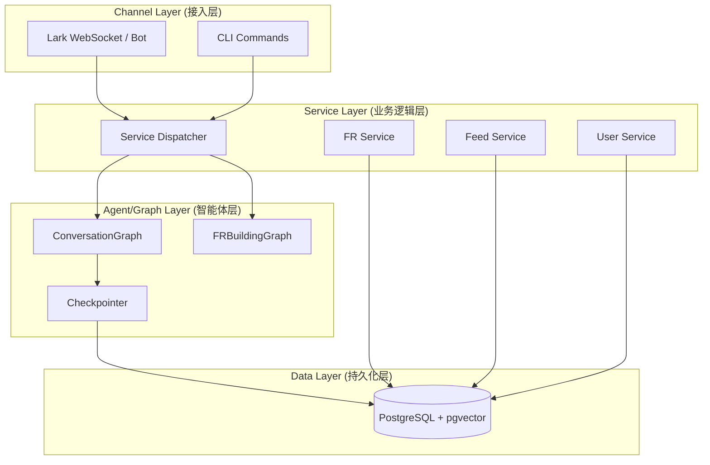
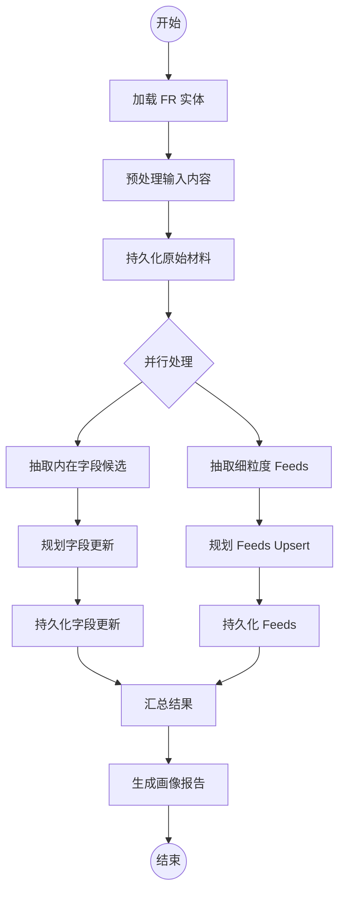
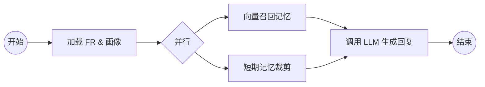
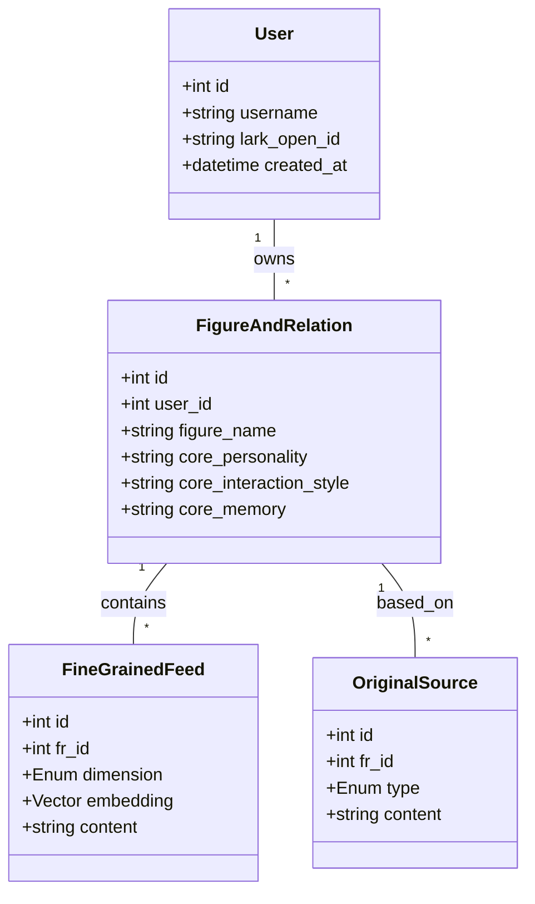

# 项目概览

## 目录
1. [模块概览](#模块概览)
2. [项目简介](#项目简介)
3. [核心功能](#核心功能)
4. [技术栈](#技术栈)
5. [架构概览](#架构概览)
6. [核心组件详解](#核心组件详解)
7. [数据模型与存储](#数据模型与存储)
8. [飞书集成与交互](#飞书集成与交互)
9. [CLI 管理与运维](#cli-管理与运维)
10. [文件引用](#文件引用)

## 模块概览

本章节通过对 `Digital Immortality` 项目的深度探索，旨在为读者提供一个清晰的全景视图。项目代码库结构严谨，逻辑分明，体现了高度的工程化水平。

**代码库规模评估**：
- **总文件数**：约 65 个源代码文件（主要为 Python）。
- **核心子模块**：
  - `src/agents/`：包含基于 LangGraph 的核心智能体工作流。这是系统的“大脑”，负责处理所有复杂的 AI 逻辑。
  - `src/channels/`：负责飞书等外部渠道的集成，实现了 WebSocket 通信和消息路由。
  - `src/cli/`：提供命令行管理工具，涵盖了从环境检查到用户认证的全流程。
  - `src/services/`：业务逻辑抽象层，封装了对底层数据的 CRUD 操作。
  - `src/database/`：数据持久化与向量检索，集成了 PostgreSQL 和 pgvector。
  - `src/utils/`：通用工具函数，包括网络请求封装和异步处理。

本页面将深入探讨 `agents` 和 `architecture` 相关模块，同时详细介绍系统的功能链路和技术实现细节。

## 项目简介

`Digital Immortality`（数字永生）是一个以 **人物画像构建（Persona Building）** 与 **持续化人格交互（Persistent Personality Interaction）** 为核心的 AI 工程化系统。

项目的核心愿景是通过 AI 技术实现“数字孪生”，让用户能够构建并与具有深度记忆、独特个性的数字生命进行交互。与传统的角色扮演机器人不同，`Digital Immortality` 强调工程化的数据管理和长期的语义连续性。它不仅是一个聊天机器人，更是一个能够随着交互不断进化、沉淀记忆的“数字人格”管理平台。

> **核心理念**：将感性的人格特质转化为理性的结构化数据，通过向量检索按需召回记忆，实现“越聊越懂你”的深度交互体验。

## 核心功能

系统围绕“人设构建”和“对话交互”两条主链路展开，并通过飞书集成提供产品化入口。

### 1. 人格构建 (FR Building)
通过 `FRBuildingGraph` 工作流，系统能够从用户输入的原始材料中自动抽取信息。
- **信息抽取**：利用 LLM 的抽取能力，识别人物的基本属性（如姓名、职业、MBTI 等）以及深层的性格特质。
- **冲突对齐**：当新抽取的信息与数据库中既有画像不一致时，系统不会简单覆盖，而是记录冲突并由后续逻辑或人工决定更新策略。
- **画像报告**：每轮构建结束后，系统会生成一份详细的 Markdown 报告，展示本次新增了哪些信息、更新了哪些字段，让用户直观感受到数字生命的成长。

### 2. 上下文对话 (Conversation)
基于 `ConversationGraph` 实现具备长期记忆的对话。
- **动态画像注入**：系统会根据当前对话的人物，动态从数据库加载其核心画像字段（如性格、互动风格等）并组装进 System Prompt。
- **记忆召回**：利用向量检索技术，从该人物的“细粒度信息库”中检索出与当前用户输入语义最相关的历史片段（如一段往事、某种特定的处事方式）。
- **短期记忆管理**：为了防止长对话导致的上下文爆炸（Context Overflow），系统实现了自动的消息裁剪（Trim）和滚动摘要（Summarization）机制，确保对话性能和语义连贯。

### 3. 飞书集成 (Lark Integration)
项目目前以飞书 Bot 作为主要的交互入口，实现了高度集成的交互体验。
- **实时响应**：通过长连接技术，确保消息收发的低延迟。
- **丰富交互**：不仅支持文本，还通过飞书卡片展示画像报告、人物列表等。
- **多人物管理**：用户可以在飞书中自由切换不同的数字人格，每个交互对象都有独立的记忆空间。

## 技术栈

项目采用了现代 AI 驱动的后端技术栈，强调高性能、可扩展性和可观测性。

- **语言环境**：`Python 3.12+`。利用 Python 3.12 的性能提升和原生异步支持。
- **工作流管理**：`LangGraph`。作为系统的核心引擎，LangGraph 提供了对循环工作流、节点状态管理和并发执行的完美支持。
- **LLM 服务**：`Volcengine Ark` (火山方舟)。深度集成豆包（Doubao）系列模型，包括 Lite、Mini 和 Embedding 模型。
- **数据库与 ORM**：
  - `PostgreSQL 16`：作为核心关系型数据库。
  - `pgvector`：为 PostgreSQL 提供了高效的向量存储和检索能力。
  - `SQLAlchemy`：提供了强大的 ORM 抽象。
  - `Alembic`：管理数据库模式的演进。
- **集成与部署**：
  - `Lark SDK`：封装了飞书开放平台的各种 API。
  - `Docker & Docker Compose`：简化了数据库和服务的本地化部署。
  - `uv`：作为新一代 Python 包管理器，大幅提升了依赖安装和虚拟环境管理的效率。

## 架构概览

系统采用分层架构设计，确保各模块职责清晰，具备良好的扩展性。

下列架构图展示了从用户输入到系统响应的完整分层结构，以及各层级之间的协作关系。

**架构层级深度解析**：
1.  **Channel 层**：这是系统的外壳。飞书模块负责处理长连接事件、消息解析和卡片渲染；CLI 模块则为开发者和管理员提供了强大的控制台工具，用于环境初始化、用户管理和日志查看。
2.  **Agent/Graph Layer**：这是系统的核心驱动。它不直接操作数据库，而是通过编排一系列“节点”（Node）来完成复杂的业务逻辑。`Checkpointer` 负责在节点执行间隙保存状态，支持长时运行任务的恢复。
3.  **Service Layer**：这是业务逻辑的抽象层。它封装了所有具体的业务规则（如用户注册逻辑、画像更新规则等）。特别设计的 `Service Dispatcher` 允许系统在单机开发模式和分布式微服务模式之间无缝切换。
4.  **Data Layer**：这是系统的记忆库。PostgreSQL 存储了所有结构化的关系数据，而 pgvector 插件则让数据库具备了处理高维向量的能力，支撑起系统的记忆召回功能。

**架构设计来源**:
- [src/main.py](file:///Users/bytedance/Desktop/work/Immortality/src/main.py)
- [src/service_dispatcher.py](file:///Users/bytedance/Desktop/work/Immortality/src/service_dispatcher.py)

## 核心组件详解

本节重点介绍系统中两个最重要的 LangGraph 工作流及其实现逻辑。

### 1. 画像构建流 (FRBuildingGraph)
`FRBuildingGraph` 负责将非结构化的输入转化为结构化的人格。它采用了典型的“抽取-比对-更新”模式。

该工作流的设计亮点在于其**并行执行能力**。在持久化原始材料后，系统会同时启动两个独立的分支：一个负责更新人物的核心字段（如 MBTI、职业等），另一个负责提取细粒度的 Feed 信息（如具体的性格片段或记忆）。这种设计不仅提高了执行效率，也实现了逻辑的解耦。

### 2. 对话生成流 (ConversationGraph)
`ConversationGraph` 负责生成贴合人设的回复。它不仅关注当前的输入，还关注历史上下文和长期记忆。

在对话生成过程中，系统会根据当前消息的语义，从向量数据库中召回最相关的记忆片段。这些片段会作为“额外知识”注入 Prompt。同时，为了维持对话的流畅度，系统会不断裁剪过长的历史消息，并将其转化为简短的“对话摘要”，从而在节省 Token 的同时保留长期语境。

## 数据模型与存储

数据模型是 `Digital Immortality` 的核心资产，定义了数字生命如何被存储和理解。

**核心数据实体深度解析**：
- **FigureAndRelation (FR)**：这是项目的“灵魂”实体。它不仅包含了人物的基础信息，还包含了四个核心维度的“高抽象”描述：核心性格、互动风格、程序性知识和核心记忆。这些字段构成了人物的“基本盘”。
- **FineGrainedFeed**：这是人物的“血肉”。每一个 Feed 都是一个细小的知识点或记忆片段。通过 `pgvector` 存储的 1024 维向量，系统可以实现极高精度的语义检索。
- **OriginalSource**：这是系统的“根源”。存储了所有未经处理的原始输入，确保了数据生成过程的可回溯性和透明度。

**数据模型来源**:
- [src/database/models.py](file:///Users/bytedance/Desktop/work/Immortality/src/database/models.py)

## 飞书集成与交互

飞书集成不仅是系统的 UI，更是其产品化能力的体现。

飞书模块通过 `WebSocket` 与飞书开放平台建立长连接，实现了消息的实时监听。当用户发送消息时，系统会经历以下流程：
1.  **消息路由**：识别消息类型（文本、指令或卡片交互）。
2.  **身份映射**：根据飞书 `open_id` 查找系统内的 `User` 实体。
3.  **上下文加载**：根据用户当前选中的 `FR`，加载其对话状态。
4.  **异步处理**：将任务交给 `ConversationGraph` 异步执行，并通过飞书 API 回传处理进度或最终结果。

此外，系统利用飞书卡片（Lark Card）提供了极其丰富的交互体验。例如，当画像构建完成后，系统会推送一张包含“新增信息”、“更新详情”和“冲突提示”的精美卡片，大大提升了用户的使用感知。

## CLI 管理与运维

为了保证系统的稳定运行，项目提供了一套完整的 CLI 工具链。

- **`immortality doctor`**：健康检查工具。它会逐一核对 Python 版本、环境变量配置、数据库连接性以及依赖库的完整性，是排查问题的首选工具。
- **`immortality setup`**：一键初始化工具。支持通过 Docker 自动拉起 PostgreSQL 数据库，并自动完成表结构创建和向量扩展的安装。
- **`immortality auth`**：用户认证管理。支持注册、登录以及飞书账号的绑定。
- **`immortality logs`**：日志查看工具。支持按日期筛选，方便开发者追踪线上问题。

这种“CLI 为先”的设计理念，使得 `Digital Immortality` 具备了极强的可维护性和生产环境适应能力。

## 文件引用

以下是构建项目概览时参考的核心源文件：

**核心逻辑与架构**:
- [src/main.py](file:///Users/bytedance/Desktop/work/Immortality/src/main.py) - 系统入口与服务启动逻辑
- [src/service_dispatcher.py](file:///Users/bytedance/Desktop/work/Immortality/src/service_dispatcher.py) - 服务分发机制实现
- [src/agents/graphs/FRBuildingGraph/graph.py](file:///Users/bytedance/Desktop/work/Immortality/src/agents/graphs/FRBuildingGraph/graph.py) - 画像构建工作流定义
- [src/agents/graphs/ConversationGraph/graph.py](file:///Users/bytedance/Desktop/work/Immortality/src/agents/graphs/ConversationGraph/graph.py) - 对话工作流定义

**数据与配置**:
- [src/database/models.py](file:///Users/bytedance/Desktop/work/Immortality/src/database/models.py) - 核心数据模型定义
- [README.md](file:///Users/bytedance/Desktop/work/Immortality/README.md) - 项目安装与配置指南
- [docs/BRIEF_INTRO.md](file:///Users/bytedance/Desktop/work/Immortality/docs/BRIEF_INTRO.md) - 项目设计理念与详细介绍

**Section sources**:
- [src/main.py](file:///Users/bytedance/Desktop/work/Immortality/src/main.py)
- [src/service_dispatcher.py](file:///Users/bytedance/Desktop/work/Immortality/src/service_dispatcher.py)
- [src/agents/graphs/FRBuildingGraph/graph.py](file:///Users/bytedance/Desktop/work/Immortality/src/agents/graphs/FRBuildingGraph/graph.py)
- [src/database/models.py](file:///Users/bytedance/Desktop/work/Immortality/src/database/models.py)
