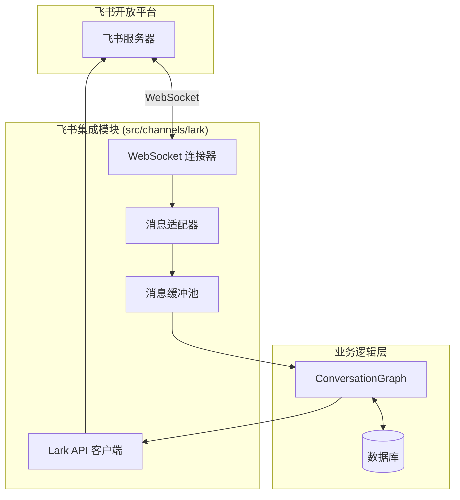
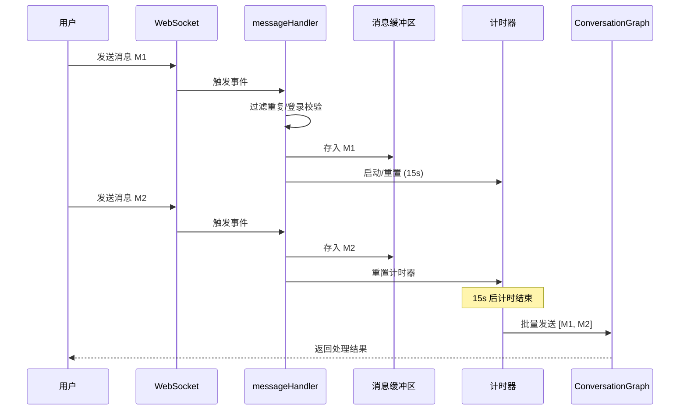

# 飞书集成与交互

## 目录
1. [模块概览](#模块概览)
2. [简介](#简介)
3. [架构设计](#架构设计)
4. [连接管理](#连接管理)
5. [事件处理流程](#事件处理流程)
6. [交互式卡片设计](#交互式卡片设计)
7. [多媒体支持](#多媒体支持)
8. [核心组件](#核心组件)
9. [文件参考](#文件参考)

## 模块概览

飞书集成模块（Lark Integration）是系统与飞书开放平台（Lark Open Platform）进行通信的核心组件。该模块负责建立长连接、接收飞书事件、分发处理逻辑以及封装飞书 API 调用。

- **总文件数**：9 个 Python 文件
- **子模块**：
    - `integration/`：负责事件分发、消息缓冲、菜单命令处理及防抖逻辑。
    - `composite_api/`：封装了飞书原生的消息发送 API，提供更高级的业务接口（如发送卡片、图片、文件）。
- **覆盖范围**：本文档将深入探讨 WebSocket 连接机制、消息批处理流程、交互式卡片构建以及多媒体文件的收发逻辑。

## 简介

飞书集成模块作为 Immortality 系统的一个 Channel（渠道），其主要职责是屏蔽飞书平台的底层协议细节，为上层的 Agent（如 `ConversationGraph`）提供统一的消息交互接口。它不仅支持基础的文本消息收发，还通过飞书消息卡片（Interactive Cards）提供了丰富的用户交互体验，如按钮点击、菜单选择等。

该模块的核心价值在于：
1. **稳定性**：通过 WebSocket 长连接和完善的重连机制，确保与飞书服务器的实时通信。
2. **效率**：引入消息缓冲机制，将短时间内的多条用户消息合并处理，降低 LLM 调用频率并提升回复的连贯性。
3. **交互性**：充分利用飞书卡片模板，提供结构化的交互界面。

## 架构设计

飞书集成模块位于系统架构的边缘层，连接外部飞书平台与内部业务逻辑。



**架构说明**：
飞书服务器通过 WebSocket 协议与系统的 `WebSocket 连接器` 建立长连接。接收到的原始事件经过 `消息适配器` 转换为内部格式，并进入 `消息缓冲池` 进行防抖和批处理。最终，合并后的消息被分发给 `ConversationGraph` 进行业务逻辑处理。处理结果通过 `Lark API 客户端` 调用飞书 OpenAPI 返回给用户。

**Diagram sources**: 
- [websocket.py](file:///Users/bytedance/Desktop/work/Immortality/src/channels/lark/websocket.py)
- [integration/index.py](file:///Users/bytedance/Desktop/work/Immortality/src/channels/lark/integration/index.py)

## 连接管理

系统采用飞书提供的 **WebSocket (长连接)** 模式进行事件订阅。相比传统的 Webhook 模式，WebSocket 无需公网 IP 或域名，且能更有效地穿透内网，适合开发调试及私有化部署场景。

### WebSocket 启动流程

在 `websocket.py` 中，通过 `lark_oapi` 提供的 `ws.Client` 启动连接。

```python
def startLarkWebSocketServer(message_handler: Callable[[str, str], None]) -> None:
    # ... 获取环境变量 LARK_APP_ID 和 LARK_APP_SECRET
    event_handler = (
        lark.EventDispatcherHandler.builder("", "", lark.LogLevel.INFO)
        .register_p2_im_message_receive_v1(
            lambda data: messageAdapter(data, message_handler)
        )
        .build()
    )
    ws_client = lark.ws.Client(
        app_id,
        app_secret,
        event_handler=event_handler,
        log_level=lark.LogLevel.INFO,
    )
    ws_client.start()
```

### 自动重连与健康检查
飞书官方 SDK (`lark_oapi`) 内部实现了 WebSocket 的心跳维持与自动重连机制。当网络波动导致连接断开时，SDK 会尝试重新建立连接，确保服务的持续可用。系统在 `startLarkService` 中调用此逻辑，并初始化数据库连接，确保整个链路的就绪。

**Section sources**:
- [websocket.py](file:///Users/bytedance/Desktop/work/Immortality/src/channels/lark/websocket.py)

## 事件处理流程

飞书集成模块对消息的处理并非简单的“收到即处理”，而是包含了一套精细的缓冲和防抖逻辑，以应对用户连续发送多条消息的情况。

### 消息生命周期



### 核心机制说明
1. **防抖 (Debounce)**：通过 `filterDuplicatedMessage` 函数，系统会记录最近收到的消息及其时间戳。如果短时间内（普通消息 30s，菜单命令 10s）收到完全相同的消息，则视为重复并丢弃。
2. **消息缓冲 (Buffering)**：在 `messageHandler` 中，消息被存入 `_pending_messages_by_open_id` 字典，并启动一个 `threading.Timer`。如果用户在 15 秒内再次发送消息，计时器会被重置。
3. **批处理执行**：计时器到期后，`_sendBatchMessages` 会从缓冲区取出该用户的所有消息，通过 `run_coroutine_threadsafe` 在专用的异步事件循环中调用 `ConversationGraph`。

> **Note**: 使用专用的后台异步循环（`_async_loop`）是为了避免 `asyncio.run()` 反复创建/销毁循环导致的数据库连接失效问题。

**Section sources**:
- [integration/index.py](file:///Users/bytedance/Desktop/work/Immortality/src/channels/lark/integration/index.py)

## 交互式卡片设计

交互式卡片是飞书集成的亮点，它允许发送结构化的内容，并支持动态变量替换。

### 卡片构建流程

系统在 `composite_api/im/send_card.py` 中封装了发送逻辑。它不直接拼接 JSON，而是使用飞书的 **卡片模板 (Template)** 功能。

```mermaid
flowchart TD
    Start[开始发送卡片] --> Check[校验标题与内容]
    Check -- 合法 --> Theme[设置主题色 (默认 blue)]
    Theme --> Construct[构建模板 JSON]
    Construct --> API[调用 client.im.v1.message.create]
    API --> Success{是否成功?}
    Success -- 是 --> End[返回成功]
    Success -- 否 --> Log[记录错误日志]
```

### 动态更新与变量
卡片内容通过 `card_variables` 传入。在模板中定义的变量（如 `{{title}}`, `{{content}}`）会在发送时被实际值替换。这种方式解耦了卡片样式与业务逻辑，使得调整 UI 无需修改代码。

```python
# 核心逻辑示例
content = json.dumps({
    "type": "template",
    "data": {
        "template_id": request.get("card_template_id"),
        "template_variable": card_variables or {},
    },
})
```

**Section sources**:
- [composite_api/im/send_card.py](file:///Users/bytedance/Desktop/work/Immortality/src/channels/lark/composite_api/im/send_card.py)

## 多媒体支持

尽管目前系统在**接收**端暂未启用图片和文件的处理逻辑（在 `websocket.py` 中标记为暂弃用），但在**发送**端已经实现了完整的支持。

### 图片与文件发送逻辑
发送多媒体消息分为两步：
1. **上传资源**：调用 `client.im.v1.image.create` 或 `client.im.v1.file.create` 将本地文件流上传到飞书服务器，获取 `image_key` 或 `file_key`。
2. **发送消息**：使用获取到的 Key 构建消息内容并发送。

```python
# 以发送图片为例
def sendImage(client: lark.Client, request: SendImageRequest) -> SendImageResponse:
    # 1. 上传
    create_image_resp = client.im.v1.image.create(create_image_req)
    # 2. 发送
    create_message_req = CreateMessageRequest.builder() \
        .msg_type("image") \
        .content(lark.JSON.marshal(create_image_resp.data)) \
        .build()
    # ...
```

**Section sources**:
- [composite_api/im/send_image.py](file:///Users/bytedance/Desktop/work/Immortality/src/channels/lark/composite_api/im/send_image.py)
- [composite_api/im/send_file.py](file:///Users/bytedance/Desktop/work/Immortality/src/channels/lark/composite_api/im/send_file.py)

## 核心组件

### 1. WebSocket 连接器 (`websocket.py`)
负责与飞书建立物理连接，并将接收到的原始 `P2ImMessageReceiveV1` 事件适配为字符串消息传递给业务处理器。它还负责从飞书加密的 Content JSON 中提取纯文本内容。

### 2. 消息集成处理器 (`integration/index.py`)
这是本模块最复杂的组件。它管理着所有活跃用户的状态（当前对话的 FR ID）、待处理消息队列以及异步任务的调度。它确保了消息的有序、不重复且高效的处理。

### 3. API 客户端单例 (`client.py`)
通过 `@lru_cache` 实现的 `larkClient` 单例，确保全局只初始化一个飞书 SDK 客户端，减少资源开销。

## 文件参考

以下是本模块涉及的核心源文件：

- [src/channels/lark/websocket.py](file:///Users/bytedance/Desktop/work/Immortality/src/channels/lark/websocket.py)：WebSocket 连接与事件适配。
- [src/channels/lark/client.py](file:///Users/bytedance/Desktop/work/Immortality/src/channels/lark/client.py)：飞书 SDK 客户端单例。
- [src/channels/lark/integration/index.py](file:///Users/bytedance/Desktop/work/Immortality/src/channels/lark/integration/index.py)：消息分发、缓冲与异步调度逻辑。
- [src/channels/lark/integration/menu.py](file:///Users/bytedance/Desktop/work/Immortality/src/channels/lark/integration/menu.py)：飞书菜单命令处理。
- [src/channels/lark/composite_api/im/send_card.py](file:///Users/bytedance/Desktop/work/Immortality/src/channels/lark/composite_api/im/send_card.py)：消息卡片发送接口。
- [src/channels/lark/composite_api/im/send_image.py](file:///Users/bytedance/Desktop/work/Immortality/src/channels/lark/composite_api/im/send_image.py)：图片上传与发送接口。
- [src/channels/lark/composite_api/im/send_file.py](file:///Users/bytedance/Desktop/work/Immortality/src/channels/lark/composite_api/im/send_file.py)：文件上传与发送接口。
- [src/channels/lark/composite_api/im/send_text.py](file:///Users/bytedance/Desktop/work/Immortality/src/channels/lark/composite_api/im/send_text.py)：基础文本消息发送接口。
